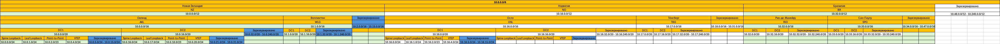

# HW-1 / Проектирование адресного пространства
## Цель
* Собрать схему CLOS;
* Распределить адресное пространство.

## Нейминг план
Предполагаем, что перед нами следующие вводные:
* Датацентры расположены в нескольких странах:
  * Новая Зелландия (NZ)
    * Окленд 
    * Веллингтон
  * Норвегия (NO)
    * Осло
    * Тёнсберг
  * Бразилия (BR)
    * Рио-де-Жанейро
    * Сан-Паулу

Следовательно, формат имени будет следующим:
(CC)-(CITY)-(DC)-(SITE)-(ROW)(RACK)-(ROLE)(ID)

* (CC): Код страны (например, NZ для Новой Зеландии, NO для Норвегии, BR для Бразилии).
* (CITY): Код города (например, AKL для Окленда, WLG для Веллингтона, OSL для Осло, TBG для Тёнсберга, RIO для Рио-де-Жанейро, SPO для Сан-Паулу).
* (DC): Идентификатор дата-центра в данном городе (например, DC1, DC2).
* (SITE): Дополнительная информация о локации внутри ЦОД (этаж, зона).
* (ROW)(RACK): Ряд и стойка.
* (ROLE): Роль устройства (например, SPN для Spine-коммутатора, LF для Leaf-коммутатора).
* (ID): Уникальный номер устройства в своей роли.

  1. NZ-AKL-DC1-F1-R12K34-SPN01
    * NZ: Новая Зеландия.
    * AKL: Окленд.
    * DC1: Дата-центр 1 в Окленде.
    * F1: Этаж 1.
    * R12K34: Ряд 12, стойка 34.
    * SPN01: Spine-коммутатор номер 01.
  2. NZ-WLG-DC2-ZB-R08K20-LF02
   * NZ: Новая Зеландия.
   * WLG: Веллингтон.
   * DC2: Дата-центр 2 в Веллингтоне.
   * ZB: Зона B.
   * R08K20: Ряд 8, стойка 20.
   * LF02: Leaf-коммутатор номер 02.
  3.	NO-OSL-DC1-F3-R05K15-SPN02
   * NO: Норвегия.
   * OSL: Осло.
   * DC1: Дата-центр 1 в Осло.
   * F3: Этаж 3.
   * R05K15: Ряд 5, стойка 15.
   * SPN02: Spine-коммутатор номер 02.
4.	NO-TBG-DC2-F2-R10K05-LF04
    * NO: Норвегия.
    * TBG: Тёнсберг.
    * DC2: Дата-центр 2 в Тёнсберге.
    * F2: Этаж 2.
    * R10K05: Ряд 10, стойка 5.
    * LF04: Leaf-коммутатор номер 04.
5.	BR-RIO-DC1-ZA-R07K22-LF03
   * BR: Бразилия.
   * RIO: Рио-де-Жанейро.
   * DC1: Дата-центр 1 в Рио-де-Жанейро.
   * ZA: Зона A.
   * R07K22: Ряд 7, стойка 22.
   * LF03: Leaf-коммутатор номер 03.
6.	BR-SPO-DC3-F1-R02K12-SPN01
   * BR: Бразилия.
   * SPO: Сан-Паулу.
   * DC3: Дата-центр 3 в Сан-Паулу.
   * F1: Этаж 1.
   * R02K12: Ряд 2, стойка 12.
   * SPN01: Spine-коммутатор номер 01.

## Адресный план для IPv4
За основу берется сеть 10.0.0.0/8

1.  **Распределение по странам**

| **Страна**    | **Код страны** | **Подсеть /12** |
|---------------|----------------|-----------------|
| Нова Зеландия | NZ             | 10.0.0.0/12     |
| Норвегия      | NO             | 10.16.0.0/12    |
| Бразилия      | BR             | 10.32.0.0/12    |
| Резерв        | -              | 10.48.0.0/12 - 10.240.0.0/12 (для будущих стран)                |

2. **Распределение сети по городам внутри страны**

**_Новая Зеландия (NZ)_**

| **Город**  | **Код города** | **Подсеть /16**                                  |
|------------|----------------|--------------------------------------------------|
| Окленд     | AKL            | 10.0.0.0/16                                      |
| Веллингтон | WLG            | 10.1.0.0/16                                      |
| Резерв     | -              | 10.2.0.0/16 - 10.15.0.0/16 (для будущих городов) |

**_Норвегия (NO)_**

| **Город** | **Код города** | **Подсеть /16**                                   |
|-----------|----------------|---------------------------------------------------|
| Осло      | OSL            | 10.16.0.0/16                                      |
| Тёнсберг  | TBG            | 10.17.0.0/16                                      |
| Резерв    | -              | 10.18.0.0/16 - 10.31.0.0/16 (для будущих городов) |

**_Бразилия (BR)_**

| **Город**      | **Код города** | **Подсеть /16**                                   |
|----------------|----------------|---------------------------------------------------|
| Рио-де-Жанейру | RIO            | 10.32.0.0/16                                      |
| Сан-Паулу      | SPO            | 10.33.0.0/16                                      |
| Резерв         | -              | 10.34.0.0/16 - 10.47.0.0/16 (для будущих городов) |

3. **Распределение сети по дата-центрам внутри городов**

Норвегия. Осло

| **ДЦ** | **Код ДЦ** | **Подсеть /20** |
|--------|------------|-----------------|
| "Мидгард"   | DC1        | 10.16.0.0/20    |
| "Альвхейм"    | DC2        | 10.16.16.0/20   |
| "Асгард"    | DC3        | 10.16.32.0/20   |
| "Ванахейм"    | DC4        | 10.16.64.0/20   |

Детализация адресного плана внутри ДЦ
Осло (OSL) - DC1 (10.16.0.0/20)

| **Назначение**               | **Подсеть**                  |
|------------------------------|------------------------------|
| Loopback адреса уровня Spine | 10.16.0.0/24                 |
| Loopback адреса уровня Leaf  | 10.16.1.0./24                |
| Point-to-Point соединения    | 10.16.2.0/23                 |
| VTEP адреса                  | 10.16.4.0/24                 |
| Резерв                       | 10.16.5.0/24 - 10.16.15.0/24 |

Относительно полная картина распределения сетей

### Адресный план в пределах одного ДЦ с устройствами

| Устройство | Имя устройства             | IP-адрес     |
|------------|----------------------------|--------------|
| Spine      | no-osl-dc1-f1-r01k01-spn01 | 10.16.0.1/32 |
| Spine      | no-osl-dc1-f1-r02k01-spn01 | 10.16.1.2/32 |
| Leaf       | no-osl-dc1-f1-r03k01-lf01  | 10.16.1.1/32 |
| Leaf       | no-osl-dc1-f1-r03k02-lf01  | 10.16.1.2/32 |
| Leaf       | no-osl-dc1-f1-r03k03-lf01  | 10.16.1.3/32 |

| Соединение                                                | Подсеть       | Устройство A                | Интерфейс | IP A       | Устройство B               | Интерфейс | IP B       |
|-----------------------------------------------------------|---------------|-----------------------------|-----------|------------|----------------------------|-----------|------------|
| no-osl-dc1-f1-r01k01-spn01 <-> no-osl-dc1-f1-r03k01-lf01  | 10.16.2.0/31  | no-osl-dc1-f1-r01k01-spn01  |           | 10.16.2.0  | no-osl-dc1-f1-r03k01-lf01  |           | 10.16.2.1  |
| no-osl-dc1-f1-r01k01-spn01 <-> no-osl-dc1-f1-r03k02-lf01  | 10.16.2.2/31  | no-osl-dc1-f1-r01k01-spn01  |           | 10.16.2.2  | no-osl-dc1-f1-r03k02-lf01  |           | 10.16.2.3  |
| no-osl-dc1-f1-r01k01-spn01 <-> no-osl-dc1-f1-r03k03-lf01  | 10.16.2.4/31  | no-osl-dc1-f1-r01k01-spn01  |           | 10.16.2.4  | no-osl-dc1-f1-r03k03-lf01  |           | 10.16.2.5  |
| no-osl-dc1-f1-r02k01-spn01 <-> no-osl-dc1-f1-r03k01-lf01  | 10.16.2.6/31  | no-osl-dc1-f1-r02k01-spn01  |           | 10.16.2.6  | no-osl-dc1-f1-r03k01-lf01  |           | 10.16.2.7  |
| no-osl-dc1-f1-r02k01-spn01 <-> no-osl-dc1-f1-r03k02-lf01  | 10.16.2.8/31  | no-osl-dc1-f1-r02k01-spn01  |           | 10.16.2.8  | no-osl-dc1-f1-r03k02-lf01  |           | 10.16.2.9  |
| no-osl-dc1-f1-r02k01-spn01 <-> no-osl-dc1-f1-r03k03-lf01  | 10.16.2.10/31 | no-osl-dc1-f1-r02k01-spn01  |           | 10.16.2.10 | no-osl-dc1-f1-r03k03-lf01  |           | 10.16.2.11 |

