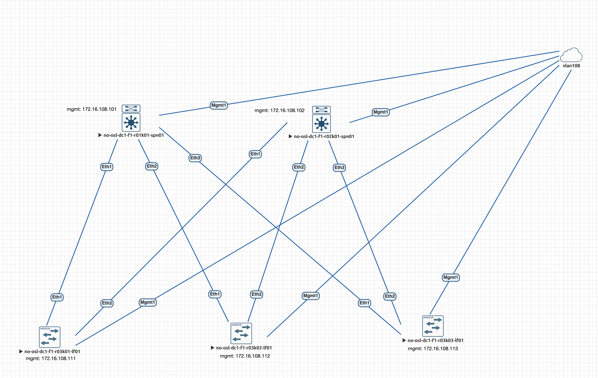

# Underlay. OSPF

## Цель
* Настроить OSPF для  Underlay сети

Ожидаемый результат:
1. Настроен OSPF в Underlay сети, IP связанность между устройствами.
2. В документации зафиксирован план работ, адресное пространство, схема сети, конфигурация устройств.
3. IP связанность между устройствами проверена и подтверждена.

## Схема сети
Кабельный журнал и IP-plan

Point-toPoint соединения

| **Соединение**                                           | **Подсеть**    | **Устройство A**                     | **Интерфейс** | **IP A**   | **Устройство B**                            | **Интерфейс** | **IP B**   |
|----------------------------------------------------------|----------------|--------------------------------------|---------------|------------|---------------------------------------------|---------------|------------|
| no-osl-dc1-f1-r01k01-spn01 <-> no-osl-dc1-f1-r03k01-lf01 | 10.16.2.0/31   | no-osl-dc1-f1-r01k01-spn01           | Ethernet 1    | 10.16.2.0  | no-osl-dc1-f1-r03k01-lf01                   | Ethernet 1    | 10.16.2.1  |
| no-osl-dc1-f1-r01k01-spn01 <-> no-osl-dc1-f1-r03k02-lf01 | 10.16.2.2/31   | no-osl-dc1-f1-r01k01-spn01           | Ethernet 2    | 10.16.2.2  | no-osl-dc1-f1-r03k02-lf01                   | Ethernet 1    | 10.16.2.3  |
| no-osl-dc1-f1-r01k01-spn01 <-> no-osl-dc1-f1-r03k03-lf01 | 10.16.2.4/31   | no-osl-dc1-f1-r01k01-spn01           | Ethernet 3    | 10.16.2.4  | no-osl-dc1-f1-r03k03-lf01                   | Ethernet 1    | 10.16.2.5  |
| no-osl-dc1-f1-r02k01-spn01 <-> no-osl-dc1-f1-r03k01-lf01 | 10.16.2.6/31   | no-osl-dc1-f1-r02k01-spn01           | Ethernet 1    | 10.16.2.6  | no-osl-dc1-f1-r03k01-lf01                   | Ethernet 2    | 10.16.2.7  |
| no-osl-dc1-f1-r02k01-spn01 <-> no-osl-dc1-f1-r03k02-lf01 | 10.16.2.8/31   | no-osl-dc1-f1-r02k01-spn01           | Ethernet 2    | 10.16.2.8  | no-osl-dc1-f1-r03k02-lf01                   | Ethernet 2    | 10.16.2.9  |
| no-osl-dc1-f1-r02k01-spn01 <-> no-osl-dc1-f1-r03k03-lf01 | 10.16.2.10/31  | no-osl-dc1-f1-r02k01-spn01           | Ethernet 3    | 10.16.2.10 | no-osl-dc1-f1-r03k03-lf01                   | Ethernet 2    | 10.16.2.11 |

Loopback интерфейсы для нужд OSPF и VTEP

| Устройство                 | Loopback 0 (OSPF) | Loopback 10 (VTEP) |
|----------------------------|-------------------|--------------------|
| no-osl-dc1-f1-r01k01-spn01 | 10.16.0.1/32      | -                  |
| no-osl-dc1-f1-r02k01-spn01 | 10.16.0.2/32      | -                  |
| no-osl-dc1-f1-r03k01-lf01  | 10.16.1.1/32      | 10.16.4.1/32       |
| no-osl-dc1-f1-r03k02-lf01  | 10.16.1.2/32      | 10.16.4.2/32       |
| no-osl-dc1-f1-r03k03-lf01  | 10.16.1.3/32      | 10.16.4.3/32       |

## Настройка OSPF
Настройка OSPF для устройств (внезапно :) ) реализована через Ansible. Идея заимствована из книги "Network Automation Cookbook" (Karim Okasha) и репозитория на Github “https://github.com/PacktPublishing/Network-Automation-Cookbook/tree/master/ch4_arista.”

**Так как copy-paste сбивает синтаксис, плэйбуки будут загружены в отдельный репо https://github.com/anton-sap/HW-2_Ansible** 

Файл инвентаря inventory представлен в следующем виде

    [spine]
    no-osl-dc1-f1-r01k01-spn01 ansible_host=172.16.108.101
    no-osl-dc1-f1-r02k01-spn01 ansible_host=172.16.108.102
    
    [leaf]
    no-osl-dc1-f1-r03k01-lf01 ansible_host=172.16.108.111
    no-osl-dc1-f1-r03k02-lf01 ansible_host=172.16.108.112
    no-osl-dc1-f1-r03k03-lf01 ansible_host=172.16.108.113
    
    [arista:children]
    spine
    leaf

Переменные содержат следующие значения:
arista.yml

    ---
    ansible_user: ansible
    ansible_ssh_pass: ansible123
    
    ansible_network_os: eos
    ansible_connection: httpapi
    ansible_httpapi_use_ssl: yes
    ansible_httpapi_validate_certs: no

all.yml

    global:
        mgmt_vrf: mgmt
        
        lo_ip:
            no-osl-dc1-f1-r01k01-spn01: "10.16.0.1/32"
            no-osl-dc1-f1-r02k01-spn01: "10.16.0.2/32"
            no-osl-dc1-f1-r03k01-lf01: "10.16.1.1/32"
            no-osl-dc1-f1-r03k02-lf01: "10.16.1.2/32"
            no-osl-dc1-f1-r03k03-lf01: "10.16.1.3/32"
        
        vtep_lo_ip:
            no-osl-dc1-f1-r03k01-lf01: "10.16.4.1/32"
            no-osl-dc1-f1-r03k02-lf01: "10.16.4.2/32"
            no-osl-dc1-f1-r03k03-lf01: "10.16.4.3/32"
        
        p2p_prefix: 31
        
        p2p_ip:
            no-osl-dc1-f1-r01k01-spn01:
              - { port: Ethernet1, ip: 10.16.2.0/31 }
              - { port: Ethernet2, ip: 10.16.2.2/31 }
              - { port: Ethernet3, ip: 10.16.2.4/31 }
              no-osl-dc1-f1-r02k01-spn01:
              - { port: Ethernet1, ip: 10.16.2.6/31 }
              - { port: Ethernet2, ip: 10.16.2.8/31 }
              - { port: Ethernet3, ip: 10.16.2.10/31 }
              no-osl-dc1-f1-r03k01-lf01:
              - { port: Ethernet1, ip: 10.16.2.1/31 }
              - { port: Ethernet2, ip: 10.16.2.7/31 }
              no-osl-dc1-f1-r03k02-lf01:
              - { port: Ethernet1, ip: 10.16.2.3/31 }
              - { port: Ethernet2, ip: 10.16.2.9/31 }
              no-osl-dc1-f1-r03k03-lf01:
              - { port: Ethernet1, ip: 10.16.2.5/31 }
              - { port: Ethernet2, ip: 10.16.2.11/31 }
            
        
        ospf_router_id:
            no-osl-dc1-f1-r01k01-spn01: "10.16.0.1"
            no-osl-dc1-f1-r02k01-spn01: "10.16.0.2"
            no-osl-dc1-f1-r03k01-lf01: "10.16.0.3"
            no-osl-dc1-f1-r03k02-lf01: "10.16.0.4"
            no-osl-dc1-f1-r03k03-lf01: "10.16.0.5"

Плейбуки несут следующие функции:

01_setup_eapi.yml - включает eAPI на устройствах

        ---
        - name: "Enable eAPI on Arista Switches"
          hosts: arista
          become: yes
          vars:
            ansible_connection: network_cli
          tasks:
            - name: "Enable eAPI"
              eos_eapi:
                  https_port: 443
                  https: yes
                  state: started
        
            - name: "Enable eAPI under VRF"
              eos_eapi:
                  state: started
                  vrf: "{{global.mgmt_vrf}}"
            
            - name: "Create user for ansible"
              eos_user:
                  name: ansible
                  privilege: 15
                  configured_password: ansible123
                  state: present
        
            - name:
              eos_command:
                  commands: aaa authorization exec default local

02_create_interface_config.yml - создает и настраивает интерфейсы устройств и присваивает адреса

    ---
    - name: "Creating and configuring L3 Interfaces"
      hosts: arista
    #  become: yes
    #  vars:
    #    ansible_connection: network_cli
    vars:
    ansible_connection: httpapi
    tasks:
    - name: "Create Loopback 0 for OSPF"
    arista.eos.eos_l3_interfaces:
    config:
      - name: Loopback 0
      ipv4:
      - address: "{{ global.lo_ip[inventory_hostname] }}"
      state: merged
    
          - name: "Set description for Loopback 0"
            arista.eos.eos_interfaces:
              config:
                - name: Loopback 0
                  description: "OSPF"
              state: merged
    
          - name: "Create Loopback 10 for VTEP"
            arista.eos.eos_l3_interfaces:
              config:
                - name: Loopback 10
                  ipv4:
                    - address: "{{ global.vtep_lo_ip[inventory_hostname] }}"
              state: merged
            when: "'leaf' in group_names"
    
          - name: "Create Point-to-Point Interfaces"
            loop: "{{ global.p2p_ip[inventory_hostname] | default([]) }}"
            loop_control:
              label: "{{ item.port }}"
            arista.eos.eos_interfaces:
              config:
                - name: "{{ item.port}}"
                  enabled: true
                  mode: layer3
    
          - name: "Configure IP on Point-to-Point Interfaces"
            loop: "{{ global.p2p_ip[inventory_hostname] | default([]) }}"
            loop_control:
              label: "{{ item.port }}"
            arista.eos.eos_l3_interfaces:
              config:
                - name: "{{ item.port}}"
                  ipv4:
                    - address: "{{ item.ip }}"
              state: merged

03_ospf.yml - настраивает OSPF

        ---
        - name: "Building UP OSPF"
          hosts: arista
          vars:
          ansible_connection: httpapi
          tasks:
            - name: "Enable ip routing"
              arista.eos.eos_config:
              lines:
              - ip routing
        
            - name: "Set up OSPF config"
              arista.eos.eos_ospfv2:
              config:
              processes:
              - process_id: 1
              point_to_point: true
              adjacency:
              exchange_start:
              threshold: 20045623
              max_lsa:
              count: 8000
              ignore_count: 3
              ignore_time: 6
              reset_time: 20
              threshold: 40
              networks:
              - area: "0.0.0.0"
              prefix: 10.16.0.0/24
              - area: "0.0.0.0"
              prefix: 10.16.1.0/24
              - area: "0.0.0.0"
              prefix: 10.16.2.0/23
              - area: "0.0.0.0"
              prefix: 10.16.4.0/24
              redistribute:
              - routes: "connected"
              router_id: "{{ global.ospf_router_id[inventory_hostname] }}"

## Проверка корректности маршрутов и коннективности
### no-osl-dc1-f1-r01k01-spn01

Внезапно открыл для себя раскрывающий текст, а переделывать предыдущее уже хочется ¯\_(ツ)_/¯

Таблица маршрутизации no-osl-dc1-f1-r01k01-spn01
   
    
    no-osl-dc1-f1-r01k01-spn01##sh ip route
    
    VRF: default
    Codes: C - connected, S - static, K - kernel,
    O - OSPF, IA - OSPF inter area, E1 - OSPF external type 1,
    E2 - OSPF external type 2, N1 - OSPF NSSA external type 1,
    N2 - OSPF NSSA external type2, B - Other BGP Routes,
    B I - iBGP, B E - eBGP, R - RIP, I L1 - IS-IS level 1,
    I L2 - IS-IS level 2, O3 - OSPFv3, A B - BGP Aggregate,
    A O - OSPF Summary, NG - Nexthop Group Static Route,
    V - VXLAN Control Service, M - Martian,
    DH - DHCP client installed default route,
    DP - Dynamic Policy Route, L - VRF Leaked,
    G  - gRIBI, RC - Route Cache Route
    
    Gateway of last resort is not set
    
    C        10.16.0.1/32 is directly connected, Loopback0
    O        10.16.0.2/32 [110/30] via 10.16.2.1, Ethernet1
    via 10.16.2.3, Ethernet2
    via 10.16.2.5, Ethernet3
    O        10.16.1.1/32 [110/20] via 10.16.2.1, Ethernet1
    O        10.16.1.2/32 [110/20] via 10.16.2.3, Ethernet2
    O        10.16.1.3/32 [110/20] via 10.16.2.5, Ethernet3
    C        10.16.2.0/31 is directly connected, Ethernet1
    C        10.16.2.2/31 is directly connected, Ethernet2
    C        10.16.2.4/31 is directly connected, Ethernet3
    O        10.16.2.6/31 [110/20] via 10.16.2.1, Ethernet1
    O        10.16.2.8/31 [110/20] via 10.16.2.3, Ethernet2
    O        10.16.2.10/31 [110/20] via 10.16.2.5, Ethernet3
    O        10.16.4.1/32 [110/20] via 10.16.2.1, Ethernet1
    O        10.16.4.2/32 [110/20] via 10.16.2.3, Ethernet2
    O        10.16.4.3/32 [110/20] via 10.16.2.5, Ethernet3

Проверяем, что с интерфейса loopback 0 устройства no-osl-dc1-f1-r01k01-spn01 доступны loopback интерфейсы устройств

Проверка доступности loopback интерфейсов

    no-osl-dc1-f1-r01k01-spn01#ping 10.16.0.2 source 10.16.0.1
    PING 10.16.0.2 (10.16.0.2) from 10.16.0.1 : 72(100) bytes of data.
    80 bytes from 10.16.0.2: icmp_seq=1 ttl=63 time=10.6 ms
    80 bytes from 10.16.0.2: icmp_seq=2 ttl=63 time=7.29 ms
    80 bytes from 10.16.0.2: icmp_seq=3 ttl=63 time=7.11 ms
    80 bytes from 10.16.0.2: icmp_seq=4 ttl=63 time=8.07 ms
    80 bytes from 10.16.0.2: icmp_seq=5 ttl=63 time=6.26 ms
    
    --- 10.16.0.2 ping statistics ---
    5 packets transmitted, 5 received, 0% packet loss, time 41ms
    rtt min/avg/max/mdev = 6.263/7.879/10.653/1.503 ms, ipg/ewma 10.302/9.202 ms

    no-osl-dc1-f1-r01k01-spn01#ping 10.16.1.1 source 10.16.0.1
    PING 10.16.1.1 (10.16.1.1) from 10.16.0.1 : 72(100) bytes of data.
    80 bytes from 10.16.1.1: icmp_seq=1 ttl=64 time=5.46 ms
    80 bytes from 10.16.1.1: icmp_seq=2 ttl=64 time=5.32 ms
    80 bytes from 10.16.1.1: icmp_seq=3 ttl=64 time=3.60 ms
    80 bytes from 10.16.1.1: icmp_seq=4 ttl=64 time=3.48 ms
    80 bytes from 10.16.1.1: icmp_seq=5 ttl=64 time=3.22 ms
    
    --- 10.16.1.1 ping statistics ---
    5 packets transmitted, 5 received, 0% packet loss, time 21ms
    rtt min/avg/max/mdev = 3.221/4.218/5.460/0.967 ms, ipg/ewma 5.334/4.775 ms

    no-osl-dc1-f1-r01k01-spn01#ping 10.16.1.2 source 10.16.0.1
    PING 10.16.1.2 (10.16.1.2) from 10.16.0.1 : 72(100) bytes of data.
    80 bytes from 10.16.1.2: icmp_seq=1 ttl=64 time=4.49 ms
    80 bytes from 10.16.1.2: icmp_seq=2 ttl=64 time=3.56 ms
    80 bytes from 10.16.1.2: icmp_seq=3 ttl=64 time=2.50 ms
    80 bytes from 10.16.1.2: icmp_seq=4 ttl=64 time=2.53 ms
    80 bytes from 10.16.1.2: icmp_seq=5 ttl=64 time=2.61 ms
    
    --- 10.16.1.2 ping statistics ---
    5 packets transmitted, 5 received, 0% packet loss, time 16ms
    rtt min/avg/max/mdev = 2.502/3.141/4.497/0.785 ms, ipg/ewma 4.223/3.777 ms

    no-osl-dc1-f1-r01k01-spn01#ping 10.16.1.3 source 10.16.0.1
    PING 10.16.1.3 (10.16.1.3) from 10.16.0.1 : 72(100) bytes of data.
    80 bytes from 10.16.1.3: icmp_seq=1 ttl=64 time=5.61 ms
    80 bytes from 10.16.1.3: icmp_seq=2 ttl=64 time=3.07 ms
    80 bytes from 10.16.1.3: icmp_seq=3 ttl=64 time=2.37 ms
    80 bytes from 10.16.1.3: icmp_seq=4 ttl=64 time=2.46 ms
    80 bytes from 10.16.1.3: icmp_seq=5 ttl=64 time=2.42 ms
    
    --- 10.16.1.3 ping statistics ---
    5 packets transmitted, 5 received, 0% packet loss, time 21ms
    rtt min/avg/max/mdev = 2.376/3.189/5.611/1.238 ms, ipg/ewma 5.250/4.346 ms

