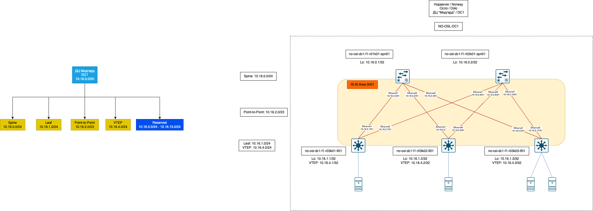
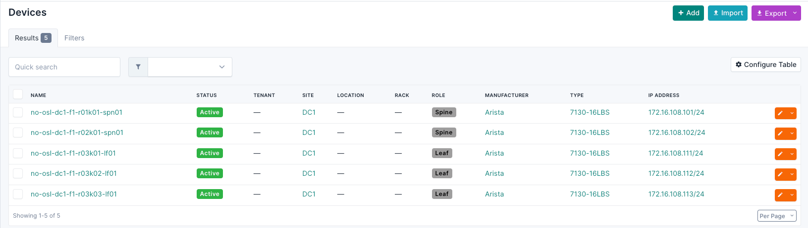

# Underlay. IS-IS

## Цель
* Настроить IS-IS для Underlay сети
>В сетях, где данные струятся,
> 
>IS-IS проводит путь незримый.
> 
>Пакеты быстро мчатся, чтобы сняться
> 
>С узлов на узел нитью неделимой.
>> А. С. ChatGPT (c.)

**Ожидаемый результат**
1. Настроен IS-IS в Underlay сети для IP-связанности между всеми сетевыми устройствами.
2. В документации зафиксирован план работ, адресное пространство, схема сети, конфигурация устройств.
3. IP-связанность между устройствами проверена и подтверждена:
   * Со всех устройств должны быть доступны Loopback интерфейсы всех устройств
   * Leaf коммутаторы должны иметь 2 (два) маршрута до других Leaf'ов

## Схема сети

Продолжаем работать со схемой из прошлого задания: 2 спайна, 3 лифа в Норвегии, Осло, DC1 "Мидгард" ヅ

Из настроек заботливо удалено всякое напоминание про OSPF.

### Немного теории про IS-IS.
Взято из Википедии: https://ru.wikipedia.org/wiki/IS-IS

Протокол маршрутизации промежуточных систем (англ. IS-IS) — протокол внутренних шлюзов (IGP), стандартизированный ISO и использующийся в основном в крупных сетях провайдеров услуг. IS-IS может также использоваться в корпоративных сетях особо крупного масштаба. IS-IS — это протокол маршрутизации на основе состояния каналов. Он обеспечивает быструю сходимость и отличную масштабируемость. Как и все протоколы на основе состояния каналов, IS-IS очень экономно использует пропускную способность сетей.

Далее, нас интересует понятие Net в IS-IS:

>Адрес ISIS NET — это то, что нам нужно настроить, когда мы используем протокол маршрутизации ISIS в сети.
>Это связано с тем, что протокол ISIS изначально был разработан для сетей CLNS. Хотя мы используем IP-адрес для маршрутизации IP-трафика, пакеты управления ISIS по-прежнему используют адрес CLNS для связи друг с другом.
>> Машинный перевод части статьи https://rayka-co.com/lesson/isis-net-address-format/#google_vignette

Формат CLNS адреса для наглядности. Пригодится позже.

Вводные для IS-IS:
   * Для упрощения и совместимости принимаем, что все устройства работают с IS-IS Level 2.
   * В качестве System ID используем видоизмененный адрес Loopback
     * 10.16.0.1 представляем видом 100.160.000.001 - добавляем лидирующих или конечных нулей
     * Переписываем значение в вид 100.160.000.001, двигаем точки и получаем: 1001.6000.0001

## Достижение результата

Тут мы эволюционируем и меняем парадигму xD. Принимаем за основу состояние сети из Netbox. Как его установить можно взять вот тут https://netboxlabs.com/docs/netbox/en/stable/installation/

После установки и конфигурирования считаем, что у нас в Netbox 5 устройств - 2 Spine-коммутатора, 3 - Leaf-коммутатора. Описываем их состояние внутри Netbox:

Для устройств создан Config Template со следующим содержимым 

