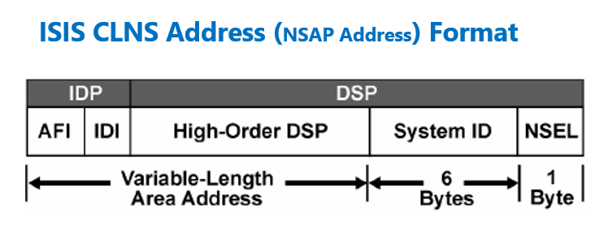

# Underlay. IS-IS

## Цель
* Настроить IS-IS для Underlay сети
>В сетях, где данные струятся,
> 
>IS-IS проводит путь незримый.
> 
>Пакеты быстро мчатся, чтобы сняться
> 
>С узлов на узел нитью неделимой.
>> А. С. ChatGPT (c.)

**Ожидаемый результат**
1. Настроен IS-IS в Underlay сети для IP-связанности между всеми сетевыми устройствами.
2. В документации зафиксирован план работ, адресное пространство, схема сети, конфигурация устройств.
3. IP-связанность между устройствами проверена и подтверждена:
   * Со всех устройств должны быть доступны Loopback интерфейсы всех устройств
   * Leaf коммутаторы должны иметь 2 (два) маршрута до других Leaf'ов

## Схема сети

Продолжаем работать со схемой из прошлого задания: 2 спайна, 3 лифа в Норвегии, Осло, DC1 "Мидгард" ヅ

Из настроек заботливо удалено всякое напоминание про OSPF.

### Немного теории про IS-IS.
Взято из Википедии: https://ru.wikipedia.org/wiki/IS-IS

Протокол маршрутизации промежуточных систем (англ. IS-IS) — протокол внутренних шлюзов (IGP), стандартизированный ISO и использующийся в основном в крупных сетях провайдеров услуг. IS-IS может также использоваться в корпоративных сетях особо крупного масштаба. IS-IS — это протокол маршрутизации на основе состояния каналов. Он обеспечивает быструю сходимость и отличную масштабируемость. Как и все протоколы на основе состояния каналов, IS-IS очень экономно использует пропускную способность сетей.

Далее, нас интересует понятие Net в IS-IS:

>Адрес ISIS NET — это то, что нам нужно настроить, когда мы используем протокол маршрутизации ISIS в сети.
>Это связано с тем, что протокол ISIS изначально был разработан для сетей CLNS. Хотя мы используем IP-адрес для маршрутизации IP-трафика, пакеты управления ISIS по-прежнему используют адрес CLNS для связи друг с другом.
>> Машинный перевод части статьи https://rayka-co.com/lesson/isis-net-address-format/#google_vignette

Формат CLNS адреса для наглядности. Пригодится позже.

Вводные для IS-IS:
   * Для упрощения и совместимости принимаем, что все устройства работают с IS-IS Level 2.
   * В качестве System ID используем видоизмененный адрес Loopback
     * 10.16.0.1 представляем видом 100.160.000.001 - добавляем лидирующих или конечных нулей
     * Переписываем значение в вид 100.160.000.001, двигаем точки и получаем: 1001.6000.0001

## Достижение результата

Тут мы эволюционируем и меняем парадигму xD. Принимаем за основу состояние сети из Netbox. Как его установить можно взять вот тут https://netboxlabs.com/docs/netbox/en/stable/installation/

После установки и конфигурирования считаем, что у нас в Netbox 5 устройств - 2 Spine-коммутатора, 3 - Leaf-коммутатора. Описываем их состояние внутри Netbox:

Для каждого устройства указаны соответствующие настройки интерфейсов средствами Netbox - адреса, кабели, состояние физического интерфейса - включен/выключен, description. 

Пример состояния интерфейсов для no-osl-dc1-f1-r01k01-spn01

Для устройств создан Config Template со содержимым https://github.com/anton-sap/otus-dc-network-design/blob/5d9ac1a77437521a542da299e5a0957398fc3e6e/HW-3%20-%20ISIS%20Underlay/files/spine_template.j2

Этот темплейт делает следующие замечательные вещи:
1. Генерирует конфигурацию для интерфейсов с именем, которое начинается на "^Ethernet", а именно:
   * Вытягивает и устанавливает IP-адрес для интерфейса из Netbox
   * Если на интерфейсе назначен IP-адрес переводит его в режим no switchport
   * Назначает ему имя процесса IS-IS
   * В случае, если интерфейс помечен, как активный в Netbox, переводит его в no shutdown
2.  Генерирует конфигурацию интферсейсов Loopback и Management
3.  Генернирует прочую общую информацию в виде
    * vrf
    * default gw для mgmt трафика
    * stp режим
    * настройки ISIS, общие для устройств
    
Остальная магия с настройками и шаблоном Jinja2 связана с понятием Config Context из Netbox

Для каждого устройства, участвующего в построении IS-IS указан локальный контекст с именем "isis_id":

`
{
    "isis_id": "0101.6000.0001"
}
`
С помощью шаблона он генериуется в NET адрес в конструкции:

    router isis {{ isis_instances.hw2_instance }}
        net {{ isis_net_prefix }}{{ isis_id }}{{ isis_net_suffix }}
        is-type {{ isis_type.type_2 }}
    !
        address-family ipv4 unicast

Весь контекст суммируется на вкладке Rendered Context и представляет собой вот это:

    {
        "isis_id": "0101.6000.0001",
        "isis_instances": {
            "hw2_instance": "hw2"
        },
        "isis_net_prefix": "49.0001.",
        "isis_net_suffix": ".00",
        "isis_type": {
            "type_1": "level-1",
            "type_2": "level-2"
        },
        "mgmt_default_gw": "172.16.108.1",
        "stp_mode": {
            "mstp": "mstp"
        },
        "vrfs": {
            "mgmt": "mgmt"
        }
    }

### PoC. Импорт конфигурационного файла, созданного в Netbox в устройства (ручной режим)

На момент написания статьи не удалось реализовать импорт конфигурации в автоматическом режиме, поэтому автор копирует конфигурацию в каждое устройство как есть. При этом предполагается, что для устройств настроен только mgmt интерфейс, привилегированный пользователь. Остальные настройки соответствуют умолчаниям.

no-osl-dc1-f1-r01k01-spn01

    hostname no-osl-dc1-f1-r01k01-spn01
    !
    management api http-commands
       no shutdown
       !
       vrf default
          no shutdown
       !
       vrf mgmt
          no shutdown
    !
    ip routing
    no ip routing vrf mgmt
    !
    ip route vrf mgmt 0.0.0.0/0 172.16.108.1
    !
    spanning-tree mode mstp
    !
    vrf instance mgmt
    !
    interface Ethernet1
      no switchport
      isis enable hw2
      ip address 10.16.2.0/31
      no shutdown
    !
    interface Ethernet2
      no switchport
      isis enable hw2
      ip address 10.16.2.2/31
      no shutdown
    !
    interface Ethernet3
      no switchport
      isis enable hw2
      ip address 10.16.2.4/31
      no shutdown
    !
    interface Ethernet4
      shutdown
    !
    interface Ethernet5
      shutdown
    !
    interface Ethernet6
      shutdown
    !
    interface Ethernet7
      shutdown
    !
    interface Ethernet8
      shutdown
    !
    interface Ethernet9
      shutdown
    !
    interface Ethernet10
      shutdown
    !
    interface Ethernet11
      shutdown
    !
    interface Ethernet12
      shutdown
    !
    interface Ethernet13
      shutdown
    !
    interface Ethernet14
      shutdown
    !
    interface Ethernet15
      shutdown
    !
    interface Ethernet16
      shutdown
    !
    interface Loopback0
      ip address 10.16.0.1/32
      isis enable hw2
      description Loopback for RE
    !
    interface Management1
      ip address 172.16.108.101/24
      vrf mgmt
    !
    router isis hw2
      net 49.0001.0101.6000.0001.00
      is-type level-2
      !
      address-family ipv4 unicast
    !
    end

    hostname no-osl-dc1-f1-r02k01-spn01
    !
    management api http-commands
    no shutdown
    !
    vrf default
    no shutdown
    !
    vrf mgmt
    no shutdown
    !
    ip routing
    no ip routing vrf mgmt
    !
    ip route vrf mgmt 0.0.0.0/0 172.16.108.1
    !
    spanning-tree mode mstp
    !
    vrf instance mgmt
    !
    interface Ethernet1
    no switchport
    isis enable hw2
    ip address 10.16.2.6/31
    no shutdown
    !
    interface Ethernet2
    no switchport
    isis enable hw2
    ip address 10.16.2.8/31
    no shutdown
    !
    interface Ethernet3
    no switchport
    isis enable hw2
    ip address 10.16.2.10/31
    no shutdown
    !
    interface Ethernet4
    no shutdown
    !
    interface Ethernet5
    no shutdown
    !
    interface Ethernet6
    no shutdown
    !
    interface Ethernet7
    no shutdown
    !
    interface Ethernet8
    no shutdown
    !
    interface Ethernet9
    no shutdown
    !
    interface Ethernet10
    no shutdown
    !
    interface Ethernet11
    no shutdown
    !
    interface Ethernet12
    no shutdown
    !
    interface Ethernet13
    no shutdown
    !
    interface Ethernet14
    no shutdown
    !
    interface Ethernet15
    no shutdown
    !
    interface Ethernet16
    no shutdown
    !
    interface Loopback0
    ip address 10.16.0.2/32
    isis enable hw2
    description Loopback for RE
    !
    interface Management1
    ip address 172.16.108.102/24
    vrf mgmt
    !
    router isis hw2
    net 49.0001.0101.6000.0002.00
    is-type level-2
    !
    address-family ipv4 unicast
    !
    end

