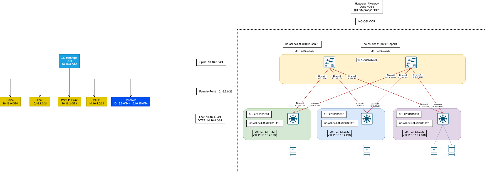
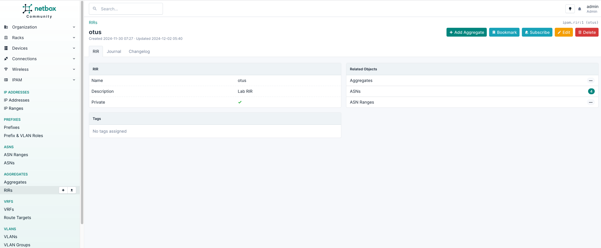
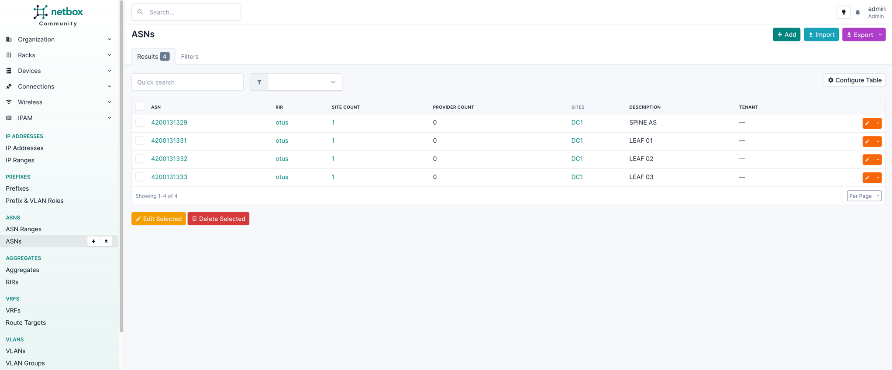
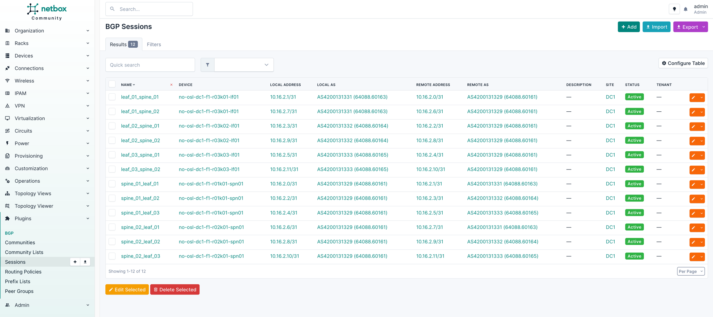

# Underlay. BGP

## Цель
* Настроить BGP для Underlay сети

**Ожидаемый результат**
1. Настроен BGP в Underlay сети и IP-связанность между всему сетевыми устройствами.
2. В документации зафиксирован план работ, адресное пространство, схема сети и конфигурация устройств.
3. Подтверждена IP-связанность между устройствами.

## Планирование AS

Под катом планирование номеров AS

_Disclaimer_

_После сложной рабочей недели планирование AS пришлось делать с помощью чат-бота_

Предлагается следующая схема использования нумерации AS:

* Используем 32-битную нумерацию.
* Используем 32-битные частные ASNs из диапазона 4200000000–4294967294.
* Первые 16 бит отводятся для обозначения страны, остальные для использования внутри страны.

Кодируем каждую страну символом:

| Страна              | Код страны |
|---------------------|------------|
| Новая Зеландия (NZ) | 1          | 
| Норвегия (NO)       | 2          |
| Бразилия (BR)       | 3          |
| Зарезервировано     | 4–65535    |

Базовый AS номер для каждой страны вычисляется по формуле:

    Базовый AS = 4200000000 + (Код страны × 65536)

**Пример для Норвегии:**

    AS = 4200000000 + (2 × 65536) = 4200131072

Структура внутри страны:

    [Код города (8 бит)][Код региона/ДЦ (8 бит)]

Пример для Норвегии (NO)

| Город           | Код города |
|-----------------|------------|
| Осло (OSL)      | 1          |
| Тёнсберг (TBG)  | 2          |
| Зарезервировано | 3-255      |

Базовый AS для города вычисляется следующим образом:

    Базовый AS города = Базовый AS страны + (Код города × 256)

**Пример для Осло (OSL)**

    AS = 4200131072 + (1 × 256) = 4200131328

Расчет распределения AS внутри города по датацентрам.

| ДЦ               | Код ДЦ |
|------------------|--------|
| DC1 ("Мидгард")  | 1      |
| DC2 ("Альвхейм") | 2      |
| Зарезервировано  | 3-255  |

Для DC1 ("Мидгард")

    AS = 4200131328 + 1 = 4200131329

Spine-коммутаторы: AS 4200131329

Leaf-коммутаторы: диапазон 4200131331–4200131583 для уникальных ASNs.

_Заметка._

_Распределение AS нужно пересмотреть в пределах Города-ДЦ. Пока используем так._

------------------------------

* Для Spine-коммутаторов внутри DC1 ("Мидгард") используем следующую AS: 4200131329
* Для каждого Leaf-коммутатора используем уникальный номер AS:
  * no-osl-dc1-f1-r03k01-lf01 - 4200131331
  * no-osl-dc1-f1-r03k02-lf01 - 4200131332
  * no-osl-dc1-f1-r03k03-lf01 - 4200131333

То же самое, но табличкой:

| Unit                       | Simple Name | AS Number   |
|----------------------------|-------------|-------------|
| no-osl-dc1-f1-r01k01-spn01 | Spine01     | 4200131329  |
| no-osl-dc1-f1-r02k01-spn01 | Spine02     | 4200131329  |
| no-osl-dc1-f1-r03k01-lf01  | Leaf01      | 4200131331  |
| no-osl-dc1-f1-r03k02-lf01  | Leaf02      | 4200131332  |
| no-osl-dc1-f1-r03k03-lf01  | Leaf03      | 4200131333  |

На картинке выглядит так:

## Достижение результата

В результате поисков путей реализации лабораторный Netbox был дополнен двумя, на мой взгляд, полезными плагинами:
* NetBox BGP Plugin https://github.com/netbox-community/netbox-bgp/ - документирование BGP.
* NextBox UI Plugin https://github.com/iDebugAll/nextbox-ui-plugin - визуализация топологий.

Итак, мы имеем установленный и настроенный Netbox с плагином "NetBox BGP Plugin". Далее, нам нужно заполнить информацию о BGP, а именно:
1. Создать в разделе `IPAM -> Aggregates -> RIRs` хотя бы один [RIR](https://en.wikipedia.org/wiki/Regional_Internet_registry)

2. Создать в разделе `IPAM -> ASNS -> ASNs` автономные системы согласно таблички выше и соотнести их к RIR:

3. Заполнить информацию о BGP сессиях в разделе `Plugins ->BGP -> Sessions` :

_Примечание_

* _Для массового добавления нужно использовать импорт._
* _Высокий риск допустить ошибку при ручном заполнении._
