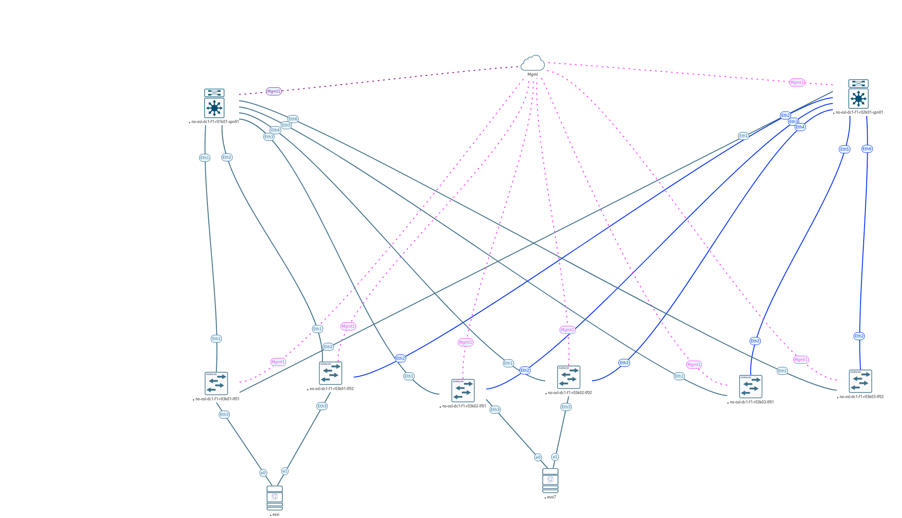

# VxLAN. L2 VNI

## Цель
* Настроить Overlay на основе VxLAN EVPN для L2 связанности между клиентами

**Ожидаемый результат**
* Настроен BGP peering между Leaf и Spine в AF l2vpn evepn.
* Настроена и проверена IP связанность между клиентами в первой зоне.
* В документации зафиксирован план работ, адресное пространство, схема сети и конфигурация устройств.

## Небольшое введение
Перед началом работы на этим Д/З немного меняем топологию сети. Делаем задел на будущее - масштабирование в пределах одного ДЦ, масштабирование в 2 и более ДЦ с растягиваением L2 (чего делать очень не рекомендуют), включение в схему с l2vni файрволов. 

Представляем, что у нас:
* 2 Spine-коммутатора в разных сетевых стойках
* 2 стойки и в каждой по 2 Leaf-коммутатора и 1 гипервизор на базе VMware ESXi 8.x
* 1 стойка с парой border-leaf и/или service-leaf.
  Всего в схеме теперь 8 коммутаторов и 2 гипервизора.

В EVE-NG сейчас это выглядит так:

