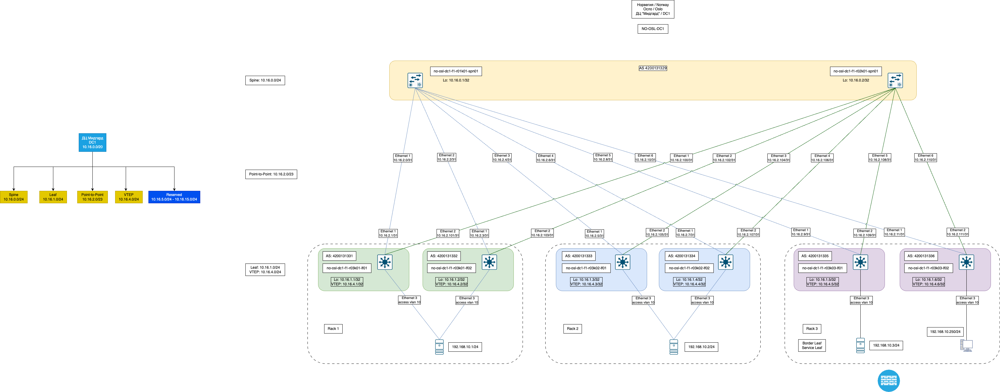

# VxLAN. L2 VNI

## Цель
* Настроить Overlay на основе VxLAN EVPN для L2 связанности между клиентами

**Ожидаемый результат**
* Настроен BGP peering между Leaf и Spine в AF l2vpn evepn.
* Настроена и проверена IP связанность между клиентами в первой зоне.
* В документации зафиксирован план работ, адресное пространство, схема сети и конфигурация устройств.

## Небольшое введение
Перед началом работы на этим Д/З немного меняем топологию сети. Делаем задел на будущее - масштабирование в пределах одного ДЦ, масштабирование в 2 и более ДЦ с растягиваением L2 (чего делать очень не рекомендуют), включение в схему с l2vni файрволов. 

Представляем, что у нас:
* 2 Spine-коммутатора в разных сетевых стойках
* 2 стойки и в каждой по 2 Leaf-коммутатора и 1 гипервизор на базе VMware ESXi 8.x
* 1 стойка с парой border-leaf и/или service-leaf.
  Всего в схеме теперь 8 коммутаторов и 2 гипервизора.

Идем в свой выдуманный ДЦ в Netbox и смотрим на расположение оборудования:

Мы же в самом начале этого увлекательного путешествия решили, что:
1. Spine-коммутаторы расположены в разных серверных стойках
2. Leaf-коммутаторы сгруппированы по 2 в качестве Top of Rack устройств (пока это standalone устройства, дальше будем пробовать их в m-lag).

Из-за добавившихся устройств возникла необходимость в обновлении BGP сессий внутри Netbox. Проблема с автоматизацией или генерацией все еще актуальна и не решена, но для минимизации ошибок воспользуемся Excel'ем. [Ссылка на файл](https://github.com/anton-sap/otus-dc-network-design/blob/master/HW-5%20-%20VxLAN%20EVPN%20L2/files/bgp_session.xlsx)

В файле нет рокет сайнс. На первом листе справочники устройств, AS и адресов. На втором листе их можно выбрать из drop-down меню:

А потом скопировать и вставить в поли импорта Netbox:

В результате получается вполне годный список сессий для последующего использования в Netbox `Provisioning -> Config Templates`

_Здесь стоит сделать паузу. Куратор курса дал направление в сторону динамических соседей. Это нужно обдумать, так как инфо в Netbox нужно будет отдавать с устройств. Подумаем позже над этим._

## Достижение результата
### Шаблон конфигурации
Как и прежде, конфигурация устройств генерируется внутри Netbox на основе его данных через шаблоны. Методом проб и ошибок я пришел к тому, что шаблон нужно разделить для групп устройств. Теперь их два - один для Spine'ов [hw5_netbox_spine_bgp_template.jinja2](https://github.com/anton-sap/otus-dc-network-design/blob/master/HW-5%20-%20VxLAN%20EVPN%20L2/files/hw5_netbox_spine_bgp_template.jinja2), второй - для Leaf'ов [hw5_netbox_leaf_bgp_template.jinja2](https://github.com/anton-sap/otus-dc-network-design/blob/master/HW-5%20-%20VxLAN%20EVPN%20L2/files/hw5_netbox_leaf_bgp_template.jinja2).

Тут, пожалуй, стоит подробнее остановиться на том, как шаблоны работают.

SPINE

Этот шаблон Jinja2 генерирует конфигурацию сетевого устройства (под управлением Arista EOS), используя данные из NetBox и связанных контекстов. Его цель — автоматически сформировать готовый к применению конфиг на основе инвентаря устройства, его интерфейсов, IP-адресов, BGP-сессий, VRF, VLAN, параметров STP и маршрутов.

Ниже — более детальный разбор того, что делает шаблон:
1.	Базовые настройки безопасности и управления:
   * no aaa root: Выключает определённые AAA настройки по умолчанию.
   * Настройка пользователя admin с ролью network-admin и заданным секретом.
   * transceiver qsfp default-mode 4x10G: Определяет режим работы QSFP-трансиверов.
   * service routing protocols model multi-agent: Переключение модели протоколов маршрутизации на «multi-agent» (особенность Arista EOS).
2.	Hostname и VRF для управления:
   *	hostname {{ device.name }}: Устанавливает имя устройства согласно данным из NetBox.
   *	vrf instance {{ vrfs.mgmt }}: Создаёт VRF для управления (management VRF), имя которого берётся из шаблона vrfs.mgmt.
3.	Управление через API и VRF:
*	В блоке : Настраивается management api http-commands, включается no shutdown для default VRF и управленческого VRF, что позволяет управлять устройством по API из правильного VRF.
4.	Маршрутизация:
   * Включается IP-маршрутизация (ip routing).
   * no ip routing vrf {{ vrfs.mgmt }} — отключение маршрутизации в этом VRF.
   * Настройка статического маршрута по умолчанию в management VRF (ip route vrf {{ vrfs.mgmt }} 0.0.0.0/0 {{ mgmt_default_gw }}), указывая на шлюз по умолчанию для управления.
5.	Spanning-tree режим:
   * Перебираются настройки STP, заданные в stp_mode, и устанавливается режим spanning-tree.
6.	Настройка интерфейсов:
   * Перебираются все интерфейсы устройства (device.interfaces.all()).
   * Для Ethernet-интерфейсов:
   * Если есть IP-адрес: интерфейс переводится в L3-режим (no switchport), задаётся MTU, настраивается BFD и назначается IP. Включается или выключается исходя из флага enabled.
   * Если IP-адреса нет: интерфейс остаётся L2 (switchport), выбирается access или trunk режим, VLANы, native VLAN для trunk при необходимости.
   * Описание интерфейса, если указано.
   * Для Loopback-интерфейсов:
   * Назначение IP-адресов.
   * Добавление описания, если оно есть.
   * Для Management-интерфейсов:
   * Назначение IP-адресов и привязка к VRF для управления.
   * Добавление описания, если есть.
7.	Настройка BGP EVPN:
   * Цикл по BGP-сессиям, сгруппированным по local_as.
   * Устанавливается router bgp <local_asn> с router-id, взятым из IP Loopback0.
   * maximum-paths 2: Разрешает множественные пути.
   * Настраивается peer-group (leaf_peers), bfd, отправка расширенных сообществ (send-community extended).
   * Перебираются BGP-сессии (sessions): для каждого соседа устанавливается neighbor ... remote-as ... и назначение в peer-group.
   * Включается address-family evpn с neighbor ... activate для обмена EVPN-маршрутами.
8.	Команда end: Завершение конфигурационного файла.

Итог:
Шаблон берёт данные о устройстве, его интерфейсах, IP-адресах, BGP-сеансах, VRF, STP-режиме и т.д. из NetBox (и связанных переменных device, vrfs, stp_mode, bgp_peer_groups, mgmt_default_gw) и формирует полный конфигурационный скрипт для сетевого устройства. Он автоматизирует процесс конфигурации, устраняет необходимость ручной настройки и снижает риск ошибок.

LEAF

Этот шаблон Jinja2 автоматически генерирует конфигурацию сетевого коммутатора (под управлением Arista EOS) на основе данных, полученных из NetBox или других контекстных переменных. Рассмотрим основные аспекты, которые он реализует:

1.	Начальные настройки устройства:
  * no aaa root: Отключение некоторых настроек AAA по умолчанию.
  * Создание пользователя admin с заданной ролью и секретом.
  * Настройка трансиверов QSFP в режим 4x10G.
  * Переключение модели протоколов маршрутизации на multi-agent.
  * Установка hostname устройства (hostname {{ device.name }}).
2.	Настройка VRF и управления:
  * Создаёт VRF для управления (vrf instance {{ vrfs.mgmt }}).
  * В блоке management api http-commands включается доступ к API и отключение shutdown для default и management VRF.
3.	Маршрутизация:
  * Включается IP-маршрутизация (ip routing).
  * no ip routing vrf {{ vrfs.mgmt }} — специфическое отключение маршрутизации в mgmt VRF.
  * Настройка prefix-list для loopback10 (ip prefix-list loopback-list).
  * Добавление статического маршрута по умолчанию в management VRF (ip route vrf {{ vrfs.mgmt }} 0.0.0.0/0 {{ mgmt_default_gw }}).
  * route-map loopback-map для фильтрации и распространения loopback-маршрутов.
4.	Spanning-Tree и VLAN:
  * Настраивает режимы spanning-tree, используя данные из stp_mode.
  * Генерирует конфигурацию для всех VLAN, связанных с сайтом устройства: vlan `<vid>` с name `<vlan.name>`.
5.	Настройка интерфейсов:
  * Перебирает все интерфейсы устройства:
  * Ethernet интерфейсы:
  * Если есть IP-адрес: задаётся MTU, L3-режим (no switchport), BFD, IP-адрес. Интерфейс поднимается или выключается по флагу enabled, добавляется description при наличии.
  * Если IP-адресов нет: интерфейс становится L2 (access или trunk), назначаются VLAN согласно mode и untagged/tagged VLAN.
  * Loopback интерфейсы: Назначаются IP-адреса, описание при наличии.
  * Management интерфейсы: Назначаются IP-адреса, привязываются к управленческому VRF, описание при наличии.
6.	VXLAN конфигурация:
  * Создаётся интерфейс Vxlan1.
  * Указывается vxlan source-interface Loopback10, vxlan udp-port 4789.
  * Перебираются VLAN сайта и для каждого создаётся сопоставление `vxlan vlan <vid> vni <100000 + vid>` — таким образом, каждому VLAN назначается свой VNI.
7.	BGP EVPN конфигурация:
  * Перебираются BGP-сессии, сгруппированные по локальному AS.
  * Настраивается router bgp <local_asn> с router-id, равным адресу Loopback0.
  * Задаётся peer-group для leaf (spine_peers), включается BFD, send-community extended.
  * Добавляются соседи (neighbor) из sessions с указанием remote-as.
  * redistribute connected route-map loopback-map позволяет распространить локальные loopback маршруты через BGP.
  * Настройка EVPN address-family: активируется соседи из peer-group для EVPN.
Дополнительно, для каждого VLAN генерируется EVPN-секция:

`    vlan <vid>
       rd auto
       route-target both <vid>:<100000+vid>
       redistribute learned`

Это добавляет L2VPN EVPN параметры для каждого VLAN, определяя RD и RT, необходимые для обмена EVPN-маршрутами (MAC/IP) между участниками EVPN-фабрики.

Итог:
Шаблон собирает вместе множество данных о устройстве и его окружении (имя, интерфейсы, IP-адреса, VRF, VLAN, BGP, EVPN) и генерирует полноценную конфигурацию, готовую к применению. Он автоматически настраивает базовые параметры безопасности и управления, линейные и петлевые интерфейсы, L2/L3 параметры, VXLAN/EVPN для мульти-тенантной сети, а также объявляет маршруты и параметры BGP для обмена маршрутами (включая EVPN).

Например, для устройства no-osl-dc1-f1-r03k01-lf01 на основании настроек интерфейсов в Netbox сгенерируется следующий конфиг

no-osl-dc1-f1-r03k01-lf01.conf

    no aaa root
    !
    username admin role network-admin secret sha512 $6$rrnahywJrf./cxZU$WLwjSO8L/iXagrGAHvaZfp4zFCmX017V3NR0vfqm9Xj0gg24gyCi/5pHahpF503vWpWMjtyKqTp.Q/YqEfPmT/
    !
    transceiver qsfp default-mode 4x10G
    !
    service routing protocols model multi-agent
    !
    hostname no-osl-dc1-f1-r03k01-lf01
    !
    vrf instance mgmt
    !
    management api http-commands
       no shutdown
       !
       vrf default
          no shutdown
       !
       vrf mgmt
          no shutdown
    !
    ip routing
    no ip routing vrf mgmt
    !
    ip prefix-list loopback-list
      seq 10 permit 10.16.4.1/32
    !
    ip route vrf mgmt 0.0.0.0/0 172.16.108.1
    !
    route-map loopback-map permit 10
       match ip address prefix-list loopback-list
    !
    spanning-tree mode mstp
    !
    vlan 10
      name vmware_vlan
    !
    vlan 20
      name vm_vlan_20
    !
    vlan 30
      name vm_vlan_30
    !
    interface Ethernet1
      mtu 9214
      no switchport
      bfd interval 200 min-rx 200 multiplier 3
      ip address 10.16.2.1/31
      no shutdown
    !
    interface Ethernet2
      mtu 9214
      no switchport
      bfd interval 200 min-rx 200 multiplier 3
      ip address 10.16.2.101/31
      no shutdown
    !
    interface Ethernet3
      switchport
      switchport mode access
      switchport access vlan 10
      no shutdown
    !
    interface Ethernet4
      switchport
      switchport mode access
      switchport access vlan 1
      shutdown
    !
    interface Ethernet5
      switchport
      switchport mode access
      switchport access vlan 1
      shutdown
    !
    interface Ethernet6
      switchport
      switchport mode access
      switchport access vlan 1
      shutdown
    !
    interface Ethernet7
      switchport
      switchport mode access
      switchport access vlan 1
      shutdown
    !
    interface Ethernet8
      switchport
      switchport mode access
      switchport access vlan 1
      shutdown
    !
    interface Ethernet9
      switchport
      switchport mode access
      switchport access vlan 1
      shutdown
    !
    interface Ethernet10
      switchport
      switchport mode access
      switchport access vlan 1
      shutdown
    !
    interface Ethernet11
      switchport
      switchport mode access
      switchport access vlan 1
      shutdown
    !
    interface Ethernet12
      switchport
      switchport mode access
      switchport access vlan 1
      shutdown
    !
    interface Ethernet13
      switchport
      switchport mode access
      switchport access vlan 1
      shutdown
    !
    interface Ethernet14
      switchport
      switchport mode access
      switchport access vlan 1
      shutdown
    !
    interface Ethernet15
      switchport
      switchport mode access
      switchport access vlan 1
      shutdown
    !
    interface Ethernet16
      switchport
      switchport mode access
      switchport access vlan 1
      shutdown
    !
    interface Loopback0
      ip address 10.16.1.1/32
      description Loopback for RE
    !
    interface Loopback10
      ip address 10.16.4.1/32
      description Loopback for VTEP
    !
    interface Management1
      ip address 172.16.108.111/24
      vrf mgmt
    !
    !
    interface Vxlan1
       vxlan source-interface Loopback10
       vxlan udp-port 4789
       vxlan vlan 10 vni 100010
       vxlan vlan 20 vni 100020
       vxlan vlan 30 vni 100030
    !
    router bgp 4200131331
       router-id 10.16.1.1
       maximum-paths 2
       neighbor SPINE-PEERS peer group
       neighbor SPINE-PEERS bfd
       neighbor SPINE-PEERS send-community extended
       neighbor 10.16.2.0 peer group SPINE-PEERS
       neighbor 10.16.2.0 remote-as 4200131329
       neighbor 10.16.2.100 peer group SPINE-PEERS
       neighbor 10.16.2.100 remote-as 4200131329
       redistribute connected route-map loopback-map
       !
       vlan 10
          rd auto
          route-target both 10:100010
          redistribute learned
       !
       vlan 20
          rd auto
          route-target both 20:100020
          redistribute learned
       !
       vlan 30
          rd auto
          route-target both 30:100030
          redistribute learned
       !
       !
       address-family evpn
          neighbor SPINE-PEERS activate
    !
    end

### Конфигурационные файлы

Сгенерированные в Netbox файлы подложены как start-up config в лабе EVE-NG как есть без ручных изменений:

* [no-osl-dc1-f1-r01k01-spn01](files/no-osl-dc1-f1-r01k01-spn01.txt)
* [no-osl-dc1-f1-r02k01-spn01](files/no-osl-dc1-f1-r02k01-spn01.txt)
* [no-osl-dc1-f1-r03k01-lf01](files/no-osl-dc1-f1-r03k01-lf01.txt)
* [no-osl-dc1-f1-r03k01-lf02](files/no-osl-dc1-f1-r03k01-lf02.txt)
* [no-osl-dc1-f1-r03k02-lf01](files/no-osl-dc1-f1-r03k02-lf01.txt)
* [no-osl-dc1-f1-r03k02-lf02](files/no-osl-dc1-f1-r03k02-lf02.txt)
* [no-osl-dc1-f1-r03k03-lf01](files/no-osl-dc1-f1-r03k03-lf01.txt)
* [no-osl-dc1-f1-r03k03-lf02](files/no-osl-dc1-f1-r03k03-lf02.txt)

### Проверка настроек
Ниже приложены скриншоты с устройства `no-osl-dc1-f1-r03k03-lf02`, к которому подключен тестовый PC на Ubuntu. С этого PC запушены ping до всех гипервизиров: 192.168.10.1, 192.168.10.2, 192.168.10.3

Вывод команды `show interfaces vxlan 1`

Вывод команды `show vxlan vtep`

Вывод команд `show mac address-table` и `show vxlan address-table`

Вывод команды `show bgp evpn route-type mac-ip`

### Тестирование на отказ

#### Сценарий 1. Перезагрузка одного из Spine-коммутаторов

В данном сценарии перезапускаем `no-osl-dc1-f1-r01k01-spn01`

Проверяем устройство `no-osl-dc1-f1-r03k03-lf02`

Видим в логе сообщения

`Dec 13 07:08:14 no-osl-dc1-f1-r03k03-lf02 Bgp: %BGP-3-NOTIFICATION: sent to neighbor 10.16.2.10 (VRF default AS 4200131329) 6/10 (Cease/BFD down <Hard Reset>) 0 bytes`

И проверяем доступность гипервизоров с тестового PC

#### Сценарий 2. Перезагрузка одного из Leaf-коммутаторов в паре Rack 1

В данном сценарии перезапускаем `no-osl-dc1-f1-r03k01-lf01`

Проверяем доступность гипервизора и он не доступен xD

Пробуем Suspend Link в EVE-NG

Убеждаемся, что гипервизор доступен через Leaf `no-osl-dc1-f1-r03k01-lf02`

В данном случае обращаем внимание на вывод:

        * >Ec    RD: 10.16.1.2:10 mac-ip 0050.5666.b8eb
        10.16.4.2             -       100     0       4200131329 4200131332 i
        *  ec    RD: 10.16.1.2:10 mac-ip 0050.5666.b8eb
           10.16.4.2             -       100     0       4200131329 4200131332 i

Это значит, что mac-адрес 0050.5666.b8eb стал доступен через leaf `no-osl-dc1-f1-r03k01-lf02`

А вывод команды `show vxlan address-table`:

                  Vxlan Mac Address Table
        ----------------------------------------------------------------------
        
        VLAN  Mac Address     Type      Prt  VTEP             Moves   Last Move
        ----  -----------     ----      ---  ----             -----   ---------
          10  0050.5660.0d45  EVPN      Vx1  10.16.4.5        1       0:02:21 ago
          10  0050.5662.ee8e  EVPN      Vx1  10.16.4.4        1       0:02:22 ago
          10  0050.5666.b8eb  EVPN      Vx1  10.16.4.2        2       0:01:01 ago
        Total Remote Mac Addresses for this criterion: 3

Говорит о том, что mac-адрес переезжал и был получен через другой VTEP

## Послесловие

Отличное задание!

Хочу выразить благодарность кураторам курса за наводящие ответы и неравнодушным однопоточникам за подсказку при траблшутинге. Особенно за команду `neighbor SPINE-PEERS send-community extended`, без которой не работало вообще ничего :xD 