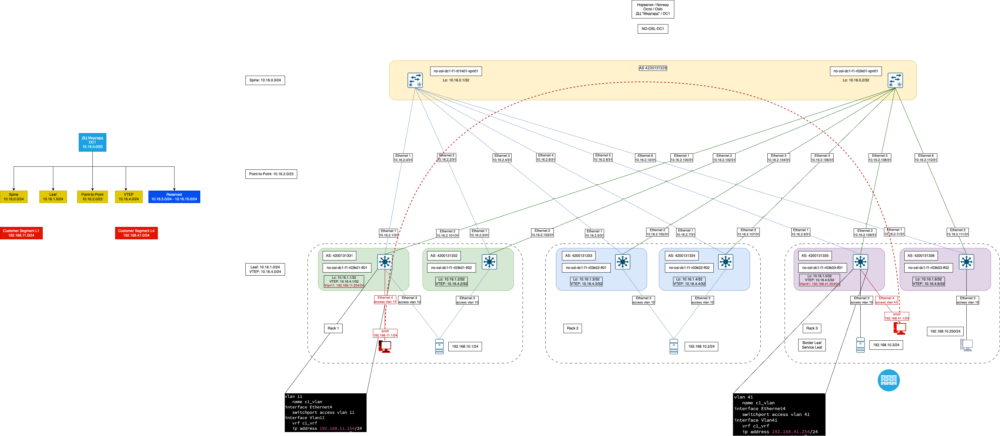

# VxLAN. EVPN L3

## Цель

* Настроить маршрутизацию в рамках Overlay между клиентами

**Ожидаемый результат**
* Каждый клиент настроен в своем VNI.
* Настроена маршрутизация между клиентами.
* В документации зафиксирован план работ, адресное пространство, схема сети и конфигурация устройств.

## Достижение результата

### Введение
За основу используется топология из предыдущего задания [Часть 5. VxLAN. EVPN L2](https://github.com/anton-sap/otus-dc-network-design/tree/master/HW-5%20-%20VxLAN%20EVPN%20L2) с небольшими изменениями.

Коротко о нововведениях:
* no-osl-dc1-f1-r03k01-lf01
  * За leaf'ом no-osl-dc1-f1-r03k01-lf01 появилась сеть 192.168.11.0/24.
  * На leaf no-osl-dc1-f1-r03k01-lf01 настроен vlan11. Порт Ethernet 4 настроен в режиме access для vlan11
  * На leaf no-osl-dc1-f1-r03k01-lf01 настроен интерфейс Vlan11 с адресом 192.168.11.254/24
  * К коммутатору на порт Ethernet 4 подключен PC с адресом 192.168.11.1/24 и gw 192.168.11.254

* no-osl-dc1-f1-r03k02-lf02
    * За leaf'ом no-osl-dc1-f1-r03k02-lf02 появилась сеть 192.168.41.0/24.
    * На leaf no-osl-dc1-f1-r03k02-lf02 настроен vlan11. Порт Ethernet 4 настроен в режиме access для vlan41
    * На leaf no-osl-dc1-f1-r03k02-lf02 настроен интерфейс Vlan11 с адресом 192.168.41.254/24
    * К коммутатору на порт Ethernet 4 подключен PC с адресом 192.168.41.1/24 и gw 192.168.41.254

### Шаблоны конфигурации

Как и прошлом задании стараемся придерживать шаблонной конфигурации устройств и ренедеринга из Netbox.

Вводятся новые понятия в Netbox:
* `IPAM -> VRFS -> VRFs`

* `IPAM -> VRFS -> Route Targets`

Для корректности конфигурации нам нужно, чтобы в конфигурацию устройств добавились секции:
* vrf
* interface Vlan[x] с привязкой к нужному VRF
* секция в BGP для работы с VRF

Шаблон конфигурации Spine-коммутаторов остается неизменным.

Описание нового [шаблона для leaf-коммутаторов](files/hw6_netbox_leaf_bgp_template.jinja2):
1. Добавлен блок для генерации VRF:

        
        
            
                
                    
                
            
        
        
        vrf instance {{ vrf_name }}
        !
        

2. В блок генерации интерфейсов и IP-адресов добавлена генерация для vlan-интерфейсов 

          
        interface {{ interface.name }}
            
          ip address {{ ip.address }}
          vrf {{ interface.ip_addresses.first().vrf.name }}
            
            
          description {{ interface.description }}
            

3. В блок генерации настроек BGP добавлена логика генерации для VRF

        
          
           vrf {{ interface.ip_addresses.first().vrf.name }}
              rd {{ device.interfaces.get(name="Loopback0").ip_addresses.first().address.ip }}:{{ interface.ip_addresses.first().vrf.id }}
              
              
                
                  
                
              
              
                
                  
                
              
              
              route-target import evpn {{ target }}
              route-target export evpn {{ target }}
              
              redistribute connected
            !
          
        

4. Другие небольшие изменения в виде фильтров для связки vlan-vni.

Таким образом, чтобы сгенерировать конфигурацию, в Netbox нужно сделать:
1. Создать VRF.
2. Добавить vlan для сайта
   1. Добавить на коммутаторе настройки физического порта
   2. Добавить на коммутаторе vlan-интерфейс с тэгом "vxlan" и назначить не него соотвествующий адрес. Для адреса указать нужный VRF (это важно).
3. Создать route-target для импорта/экспорта маршрутов и привязать их к VRF.

### Конфигурационные файлы

* [no-osl-dc1-f1-r01k01-spn01](files/configs/no-osl-dc1-f1-r01k01-spn01.txt)
* [no-osl-dc1-f1-r02k01-spn01](files/configs/no-osl-dc1-f1-r02k01-spn01.txt)
* [no-osl-dc1-f1-r03k01-lf01](files/configs/no-osl-dc1-f1-r03k01-lf01.txt)
* [no-osl-dc1-f1-r03k01-lf02](files/configs/no-osl-dc1-f1-r03k01-lf02.txt)
* [no-osl-dc1-f1-r03k02-lf01](files/configs/no-osl-dc1-f1-r03k02-lf01.txt)
* [no-osl-dc1-f1-r03k02-lf02](files/configs/no-osl-dc1-f1-r03k02-lf02.txt)
* [no-osl-dc1-f1-r03k03-lf01](files/configs/no-osl-dc1-f1-r03k03-lf01.txt)
* [no-osl-dc1-f1-r03k03-lf02](files/configs/no-osl-dc1-f1-r03k03-lf02.txt)

### Проверка настроек

* no-osl-dc1-f1-r03k01-lf01

Вывод команды `show vxlan vtep`

        no-osl-dc1-f1-r03k01-lf01#show vxlan vtep
        Remote VTEPS for Vxlan1:
        
        VTEP            Tunnel Type(s)
        --------------- --------------
        10.16.4.2       flood         
        10.16.4.3       flood         
        10.16.4.4       flood, unicast
        10.16.4.5       flood         
        10.16.4.6       flood
        
        Total number of remote VTEPS:  5

Вывод команды `show bgp evpn route-type ip-prefix ipv4`

        no-osl-dc1-f1-r03k01-lf01#show bgp evpn route-type ip-prefix ipv4
        BGP routing table information for VRF default
        Router identifier 10.16.1.1, local AS number 4200131331
        Route status codes: * - valid, > - active, S - Stale, E - ECMP head, e - ECMP
                            c - Contributing to ECMP, % - Pending BGP convergence
        Origin codes: i - IGP, e - EGP, ? - incomplete
        AS Path Attributes: Or-ID - Originator ID, C-LST - Cluster List, LL Nexthop - Link Local Nexthop
        
                  Network                Next Hop              Metric  LocPref Weight  Path
         * >      RD: 10.16.1.1:1 ip-prefix 192.168.11.0/24
                                         -                     -       -       0       i
         * >Ec    RD: 10.16.1.4:1 ip-prefix 192.168.41.0/24
                                         10.16.4.4             -       100     0       4200131329 4200131334 i
         *  ec    RD: 10.16.1.4:1 ip-prefix 192.168.41.0/24
                                         10.16.4.4             -       100     0       4200131329 4200131334 i