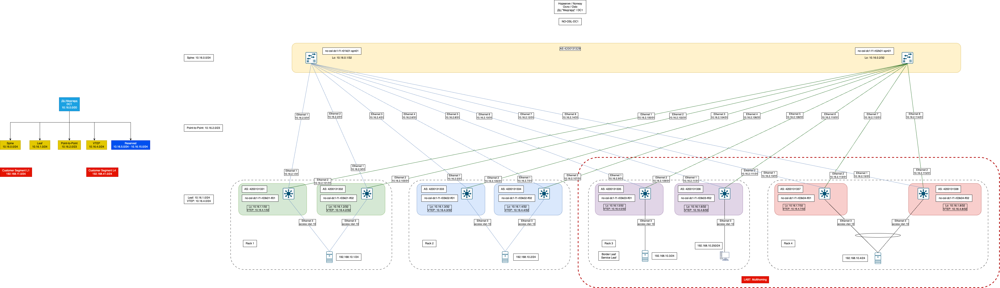

# VxLAN. Multihoming.

## Цель
* Настроить отказоустойчивое подключение клиентов с использованием EVPN Multihoming

**Ожидаемый результат**
* Клиент подключен двумя линками к различным Leaf
* Со стороны клиента настроен агрегированный канал (LACP)
* Настроен multihoming для работы в Overlay сети. В нашем случае - ESI LAG.
* Зафиксирован в документации - план работы, адресное пространство, схема сети, конфигурацию устройств.
* Протестирована отказоустойчивость. Необходимо убедиться, что связнность не теряется при отключении одного из линков.

## Достижение результата
### Введение

Вводятся новые понятия, а именно:

* **ES - ethernet segment**. An Ethernet segment is associated with an access-facing interface of a VTEP and represents the connection
  with a host device. Each Ethernet segment is assigned a unique value known as Ethernet segment identifier
  (ESI). When a host device is connected to more than one VTEPs, then the ESI for these connections remains
  the same. [Источник](https://www.juniper.net/documentation/us/en/software/nce/evpn-lag-multihoming-guide/topics/concept/evpn-lag-guide-introduction.html)
* **ESI - Ethernet Segment Identifier**. An EVPN LAG is identified using an Ethernet segment identifier (ESI). An ESI is a mandatory attribute that is required to enable EVPN LAG server multihoming. [Источник](https://www.juniper.net/documentation/us/en/software/nce/evpn-lag-multihoming-guide/topics/task/evpn-lag-guide-esi-types-lacp.html)

  В EVPN-сетях — это ключ, по которому несколько PE-маршрутизаторов/коммутаторов идентифицируют общий Ethernet-сегмент (Multi-Homing). Он позволяет:
  1. Обнаруживать и управлять мультихомингом (Active/Active или Active/Standby).
  2. Избегать петель и дублирования кадров через split-horizon.
  3. Корректно маршрутизировать/рассылать трафик в сценариях отказоустойчивости и балансировки нагрузки.

Без ESI протокол EVPN не мог бы грамотно различать отдельные физические сегменты и обеспечивать мультихоминг с сохранением изоляции и согласованности маршрутов/кадров.

#### Схема сети

За основу принимается всё та же топология из задания [Часть 5. VxLAN. EVPN L2](https://github.com/anton-sap/otus-dc-network-design/tree/master/HW-5%20-%20VxLAN%20EVPN%20L2)

В нее добавлена еще одна пара leaf'ов. Заодно проверим на надежность "конфигуратор" из Netbox и задокументируем схему онбоардинга новых устройств xD 

Для упрощения и экономии ресурсов будем работать внутри Rack 3 и Rack 4 согласно схемы

