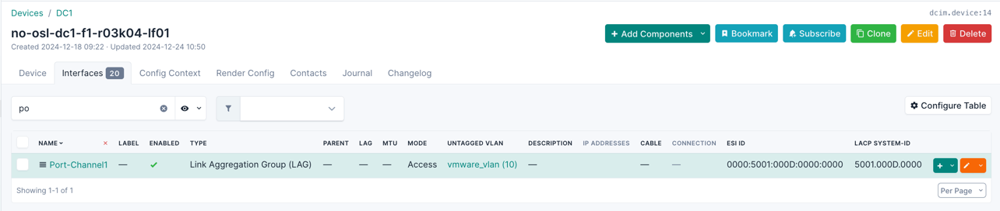
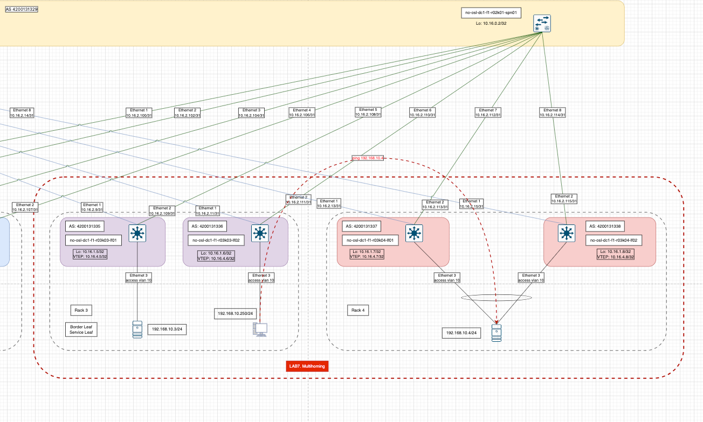
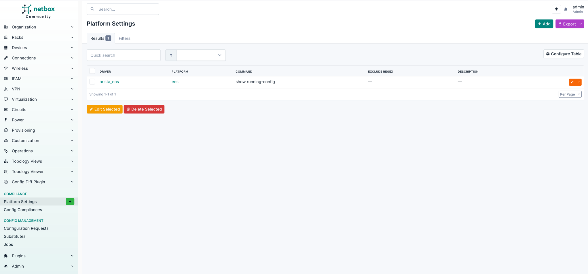
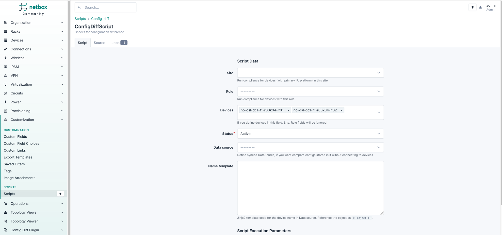
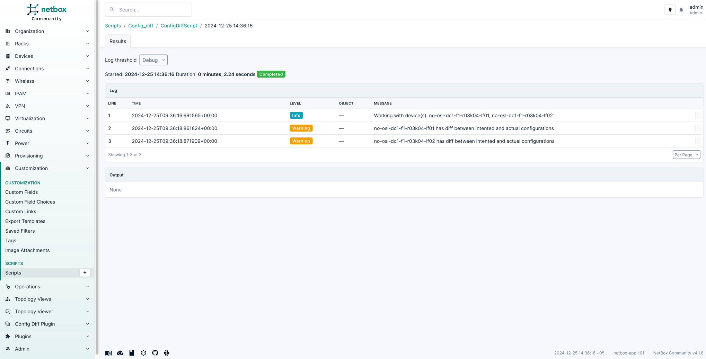
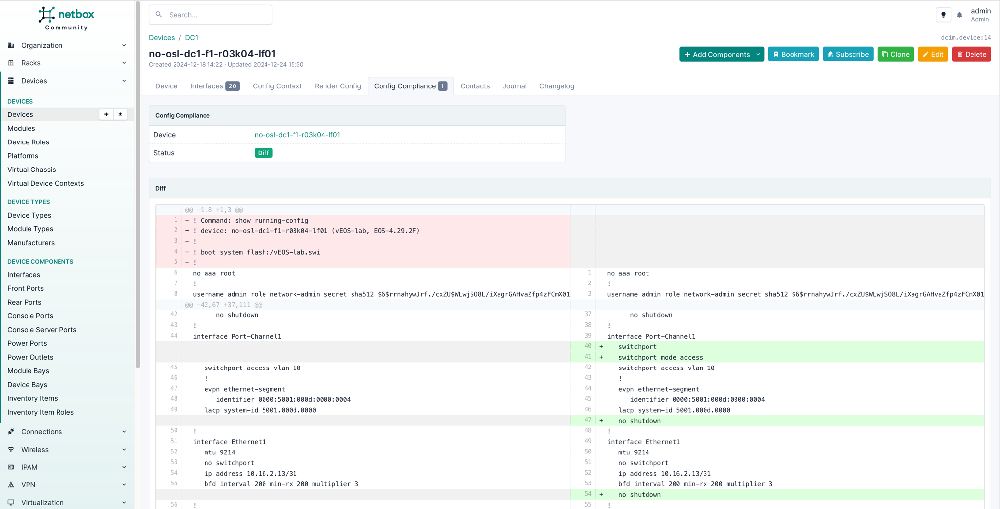
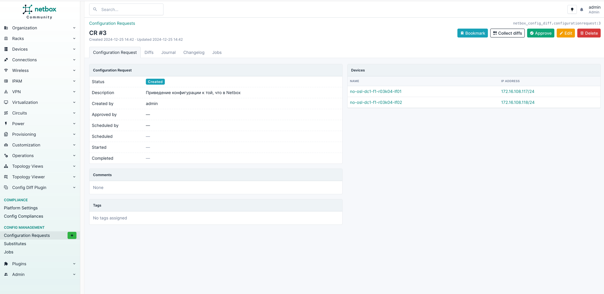
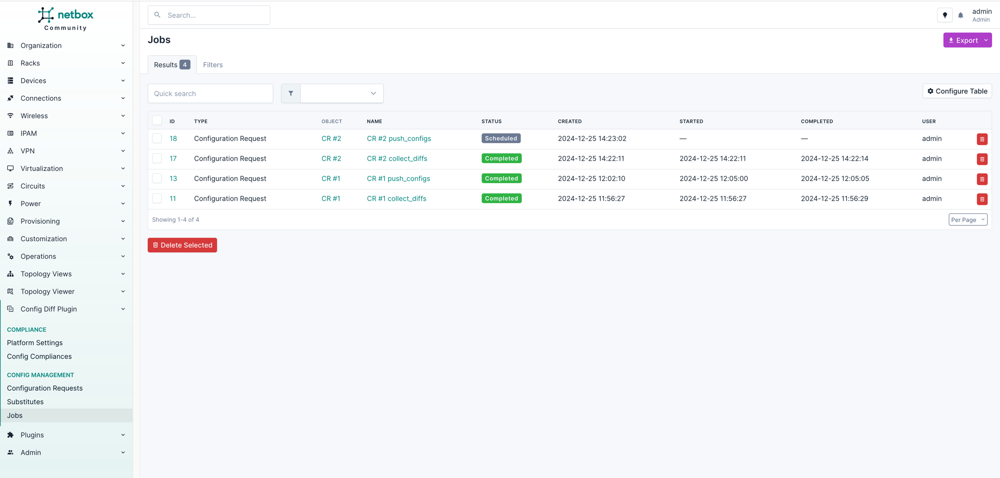
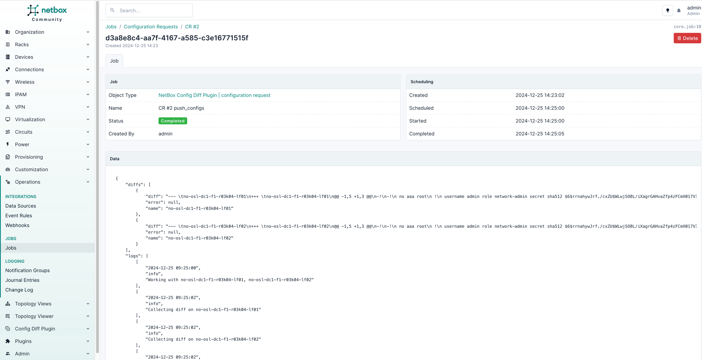

# VxLAN. Multihoming.

## Цель
* Настроить отказоустойчивое подключение клиентов с использованием EVPN Multihoming

**Ожидаемый результат**
* Клиент подключен двумя линками к различным Leaf
* Со стороны клиента настроен агрегированный канал (LACP)
* Настроен multihoming для работы в Overlay сети. В нашем случае - ESI LAG.
* Зафиксирован в документации - план работы, адресное пространство, схема сети, конфигурацию устройств.
* Протестирована отказоустойчивость. Необходимо убедиться, что связнность не теряется при отключении одного из линков.

## Достижение результата
### Введение

В качестве технического долга имеем:
* zero touch provisioning устройств 
* раскатывание конфигурации в автоматическом режиме

Вводятся новые понятия, а именно:

* **ES - ethernet segment**. An Ethernet segment is associated with an access-facing interface of a VTEP and represents the connection
  with a host device. Each Ethernet segment is assigned a unique value known as Ethernet segment identifier
  (ESI). When a host device is connected to more than one VTEPs, then the ESI for these connections remains
  the same. [Источник](https://www.juniper.net/documentation/us/en/software/nce/evpn-lag-multihoming-guide/topics/concept/evpn-lag-guide-introduction.html)
* **ESI - Ethernet Segment Identifier**. An EVPN LAG is identified using an Ethernet segment identifier (ESI). An ESI is a mandatory attribute that is required to enable EVPN LAG server multihoming. [Источник](https://www.juniper.net/documentation/us/en/software/nce/evpn-lag-multihoming-guide/topics/task/evpn-lag-guide-esi-types-lacp.html)

  В EVPN-сетях — это ключ, по которому несколько PE-маршрутизаторов/коммутаторов идентифицируют общий Ethernet-сегмент (Multi-Homing). Он позволяет:
  1. Обнаруживать и управлять мультихомингом (Active/Active или Active/Standby).
  2. Избегать петель и дублирования кадров через split-horizon.
  3. Корректно маршрутизировать/рассылать трафик в сценариях отказоустойчивости и балансировки нагрузки.

Без ESI протокол EVPN не мог бы грамотно различать отдельные физические сегменты и обеспечивать мультихоминг с сохранением изоляции и согласованности маршрутов/кадров.

#### Схема сети

За основу принимается всё та же топология из задания [Часть 5. VxLAN. EVPN L2](https://github.com/anton-sap/otus-dc-network-design/tree/master/HW-5%20-%20VxLAN%20EVPN%20L2)

В нее добавлена еще одна пара leaf'ов. Заодно проверим на надежность "конфигуратор" из Netbox и задокументируем процесс онбоардинга новых устройств xD 

Для упрощения и экономии ресурсов будем работать внутри Rack 3 и Rack 4 согласно схемы
* Внутри Rack 4 будет работать устройство на базе RHEL 8.4 с агрегированным (Bond0) интерфейсом, состоящим из двух подключений: первое - в сторону no-osl-dc1-f1-r03k04-lf01, второе - в сторону no-osl-dc1-f1-r03k04-lf02.

Это эмуляция подключения конечного сервера в двум ToR коммутаторам в пределах серверной стойки.

Тут мне попадается офигенная композиция в Яндекс.Музыке [Valhalla Calling](https://music.yandex.ru/album/31716158/track/127207559?utm_source=desktop&utm_medium=copy_link) и еще один трек [Ghost Riders in the Sky](https://music.yandex.ru/album/23613260/track/107575010?utm_source=desktop&utm_medium=copy_link). Фак, чистый кайф!

    VXLAN thunders in twilight’s dome,
    ESI’s banner guides the roaming band.
    Multihome stands as bonds of home,
    Valhalla calls—EVPN at hand!
    А. С. ChatGPT (c.)

Тут мы останавливаемся думать за генерацию ESI - он же Ethernet Segment Identifier. Самый распространённый формат — тип 0x00 (Manual), где 9 байт могут быть заданы вручную (часто встречается тип 00:aa:bb:cc:dd:...).

~~Предполагается, что ESI сегмент не распространяется за пределы серверной стойки. В таком случае мы можем привязаться к физической стойке (Rack)~~

В Netbox вводятся два новых поля  в `Customization -> Custom Fields` для документирования значений полей:
* ESI ID - идентификатор Ethernet сегмента с проверкой по Regex `^[0-9A-Fa-f]{4}(:[0-9A-Fa-f]{4}){4}$`
* LACP System-id - идентификатор LACP для коммутаторов с проверкой по Regex `^[0-9A-Fa-f]{4}(.[0-9A-Fa-f]{4}){2}$`

Шаблон для генерации конфигурации для leaf'ов  претерпел значительные изменения и заставил потратить на себя кучу времени. Основные изменения коснулись секций для интерфейсов. Теперь по каждому типу интерфейсов собственный цикл обработки. ниже приведен пример для секции Port-Channel и кастомных полей:
    
    
      
    interface {{ interface.name }}
        
        
          
      mtu 9214
      no switchport
      bfd interval 200 min-rx 200 multiplier 3
      ip address {{ ip.address }}
          
        
          
      switchport
      switchport mode access
      switchport access vlan {{ interface.untagged_vlan.vid }}
      !
          
      switchport
      switchport mode trunk
            
      switchport trunk native vlan {{ interface.untagged_vlan.vid }}
            
      switchport trunk allowed vlan {{ interface.tagged_vlans.all()|map(attribute='vid')|join(',') }}
      !
          
      switchport
      switchport mode access
      switchport access vlan 1
          
        
                               # Настройка ESI
      evpn ethernet-segment
        identifier {{ interface.custom_field_data["esi_id"] }}
        
                              # Настройка LACP
      lacp system-id {{ interface.custom_field_data["lacp_sid"] }}
        
        
      shutdown
        
      no shutdown
        
        
      description {{ interface.description }}
        
    !
      
    

Пока не ясно как и откуда генерировать ESI и LACP System-ID. В лабораторных условиях принимаем за истину, что LACP System-ID - это mac-адрес mgmt порта первого устройства в паре. Для Rack 4 это будет `5001.000D.0000`

### Файлы конфигураций устройств

Сегодня будут приложены только файлы spin'ов и leaf'ов (Rack 3, Rack 4)

Вот тут показаны дополнительные поля:

Конфигурационные файлы устройств. Напоминаю, что это выгрузка из Netbox без ручных правок
* [no-osl-dc1-f1-r01k01-spn01](files/configs/no-osl-dc1-f1-r01k01-spn01.txt)
* [no-osl-dc1-f1-r02k01-spn01](files/configs/no-osl-dc1-f1-r02k01-spn01.txt)
* [no-osl-dc1-f1-r03k03-lf01](files/configs/no-osl-dc1-f1-r03k03-lf01.txt)
* [no-osl-dc1-f1-r03k03-lf02](files/configs/no-osl-dc1-f1-r03k03-lf02.txt)
* [no-osl-dc1-f1-r03k04-lf01](files/configs/no-osl-dc1-f1-r03k04-lf01.txt)
* [no-osl-dc1-f1-r03k04-lf02](files/configs/no-osl-dc1-f1-r03k04-lf02.txt)

### Тестирование на отказ
#### Сценарий 1. Как оказалось, он же "единственный"

Пробую отключить левое плечо у сервера и вижу, что трафик не бежит. Смотрю в табличку маршрутизации на лифе стойки 3 и вижу маршрут только через одну AS - 4200131337. Вот они бенефиты отдельных AS для лифов!

    no-osl-dc1-f1-r03k03-lf02#sh bgp evpn route-type auto-discovery
    BGP routing table information for VRF default
    Router identifier 10.16.1.6, local AS number 4200131336
    Route status codes: * - valid, > - active, S - Stale, E - ECMP head, e - ECMP
                        c - Contributing to ECMP, % - Pending BGP convergence
    Origin codes: i - IGP, e - EGP, ? - incomplete
    AS Path Attributes: Or-ID - Originator ID, C-LST - Cluster List, LL Nexthop - Link Local Nexthop

              Network                Next Hop              Metric  LocPref Weight  Path
     * >Ec    RD: 10.16.1.7:10 auto-discovery 0 0000:5001:000d:0000:0000
                                   10.16.4.7             -       100     0       4200131329 4200131337 i
     *  ec    RD: 10.16.1.7:10 auto-discovery 0 0000:5001:000d:0000:0000
                                       10.16.4.7             -       100     0       4200131329 4200131337 i
       * >Ec    RD: 10.16.4.7:1 auto-discovery 0000:5001:000d:0000:0000
                                       10.16.4.7             -       100     0       4200131329 4200131337 i
     *  ec    RD: 10.16.4.7:1 auto-discovery 0000:5001:000d:0000:0000
                                       10.16.4.7             -       100     0       4200131329 4200131337 i

А проблема заключалась в том, что в Netbox для одного лифа Po1 был настроен в access vlan 10, а для второго - нет!
После правки в Netbox и заливки нового конфига результат на лифе следующий:

Вывод команды `sh bgp evpn route-type auto-discovery`

    no-osl-dc1-f1-r03k03-lf02#sh bgp evpn route-type auto-discovery
    BGP routing table information for VRF default
    Router identifier 10.16.1.6, local AS number 4200131336
    Route status codes: * - valid, > - active, S - Stale, E - ECMP head, e - ECMP
                        c - Contributing to ECMP, % - Pending BGP convergence
    Origin codes: i - IGP, e - EGP, ? - incomplete
    AS Path Attributes: Or-ID - Originator ID, C-LST - Cluster List, LL Nexthop - Link Local Nexthop
    
              Network                Next Hop              Metric  LocPref Weight  Path
     * >Ec    RD: 10.16.1.7:10 auto-discovery 0 0000:5001:000d:0000:0000
                                     10.16.4.7             -       100     0       4200131329 4200131337 i
     *  ec    RD: 10.16.1.7:10 auto-discovery 0 0000:5001:000d:0000:0000
                                     10.16.4.7             -       100     0       4200131329 4200131337 i
     * >Ec    RD: 10.16.1.8:10 auto-discovery 0 0000:5001:000d:0000:0000
                                     10.16.4.8             -       100     0       4200131329 4200131338 i
     *  ec    RD: 10.16.1.8:10 auto-discovery 0 0000:5001:000d:0000:0000
                                     10.16.4.8             -       100     0       4200131329 4200131338 i
     * >Ec    RD: 10.16.4.7:1 auto-discovery 0000:5001:000d:0000:0000
                                     10.16.4.7             -       100     0       4200131329 4200131337 i
     *  ec    RD: 10.16.4.7:1 auto-discovery 0000:5001:000d:0000:0000
                                     10.16.4.7             -       100     0       4200131329 4200131337 i
     * >Ec    RD: 10.16.4.8:1 auto-discovery 0000:5001:000d:0000:0000
                                     10.16.4.8             -       100     0       4200131329 4200131338 i
     *  ec    RD: 10.16.4.8:1 auto-discovery 0000:5001:000d:0000:0000
                                     10.16.4.8             -       100     0       4200131329 4200131338 i
    
Вывод команды `show bgp evpn route-type mac-ip`

    no-osl-dc1-f1-r03k03-lf02#show bgp evpn route-type mac-ip 
    BGP routing table information for VRF default
    Router identifier 10.16.1.6, local AS number 4200131336
    Route status codes: * - valid, > - active, S - Stale, E - ECMP head, e - ECMP
                        c - Contributing to ECMP, % - Pending BGP convergence
    Origin codes: i - IGP, e - EGP, ? - incomplete
    AS Path Attributes: Or-ID - Originator ID, C-LST - Cluster List, LL Nexthop - Link Local Nexthop

    Network                Next Hop              Metric  LocPref Weight  Path
     * >      RD: 10.16.1.6:10 mac-ip 5001.0008.0000
                                     -                     -       -       0       i
     * >Ec    RD: 10.16.1.7:10 mac-ip 5001.000f.0000
                                     10.16.4.7             -       100     0       4200131329 4200131337 i
     *  ec    RD: 10.16.1.7:10 mac-ip 5001.000f.0000
                                     10.16.4.7             -       100     0       4200131329 4200131337 i
     * >Ec    RD: 10.16.1.8:10 mac-ip 5001.000f.0000
                                     10.16.4.8             -       100     0       4200131329 4200131338 i
     *  ec    RD: 10.16.1.8:10 mac-ip 5001.000f.0000
                                     10.16.4.8             -       100     0       4200131329 4200131338 i

Как проходит трафик для пингования сервера

Вместо скриншотов видео на Youtube

## Что-то вместо выводов
1. Конфигуратор в Netbox работает очень даже сносно :-) Что прям радует.
2. Отдельная AS для leaf'ов удобна в плане восприятия информации о маршрутах и в траблшутинге
3. Документирование через Netbox не всегда можно решить "в лоб". Я попался на Port-Channel, ESI и LACP SID. А также, нужно думать между разными вендорами и платформами.
4. ESI LAG кажется удобнее, чем MC-LAG. Коллеги добились использования >2 устройств для подключения серверов, нет необходимости сопровождать peerlink и синхронизировать какие-то части конфигурации, можно использовать мультивендорную среду.

## Bonus
### Доставка конфигурации на устройства из Netbox

Так получилось, что в процессе чтения и рефлексии набрел на плагин Netbox [netbox-config-diff](https://github.com/miaow2/netbox-config-diff) , который все время обходил стороной. Но это же то, что мне было нужно все это время!

Что умеет плагин:
* Config Diff - сравнение конфигурации устройства из Render Config и реальным состоянием с помощью подключения через драйвер
* Config Managemenet - доставка конфигурации на устройства и приведение его в эталонное состояние

Настройка плагина хорошо описана в [документации](https://miaow2.github.io/netbox-config-diff/).

После установки необходимо настроить платформу на вкладке `Config Diff Plugin -> Compliance -> Platform Settings`

Список поддерживаемых платформ:
* arista_eos
* cisco_iosxe
* cisco_iosxr
* cisco_nxos
* juniper_junos

После этого можно запустить скрипт для проверки состояния устройств из вкладки `Customization -> Scripts -> ConfigDiffScript`

Результат работы скрипта:

После того, как скрипт отработает, можно провалиться в устройство и посмотреть Config Diff на вкладке `Config Compliance`

И самое интересное! Доставка конфигурации на устройства

На вкладке `Config Diff Plugin -> Config Managemenet -> Configuration Requests` создается новый запрос на изменение конфигурации и следующий порядок действий:
1. Collect Diffs - сбор информации о разности конфигураций.
2. Approve - разрешение на применение конфигурации
3. Schedule - планирование конфигурации к применению

В джобах можно посмотреть историю:

И там же посмотреть, что получилось

Лог выполнения джоба в JSON

Лог

    {
        "diffs": [
            {
                "diff": "--- \tno-osl-dc1-f1-r03k04-lf01\n+++ \tno-osl-dc1-f1-r03k04-lf01\n@@ -1,5 +1,3 @@\n-!\n-!\n no aaa root\n !\n username admin role network-admin secret sha512 $6$rrnahywJrf./cxZU$WLwjSO8L/iXagrGAHvaZfp4zFCmX017V3NR0vfqm9Xj0gg24gyCi/5pHahpF503vWpWMjtyKqTp.Q/YqEfPmT/\n@@ -39,67 +37,111 @@\n       no shutdown\n !\n interface Port-Channel1\n+   switchport\n+   switchport mode access\n    switchport access vlan 10\n    !\n    evpn ethernet-segment\n-      identifier 0000:5001:000d:0000:0000\n+      identifier 0000:5001:000d:0000:0004\n    lacp system-id 5001.000d.0000\n+   no shutdown\n !\n interface Ethernet1\n    mtu 9214\n    no switchport\n    ip address 10.16.2.13/31\n    bfd interval 200 min-rx 200 multiplier 3\n+   no shutdown\n !\n interface Ethernet2\n    mtu 9214\n    no switchport\n    ip address 10.16.2.113/31\n    bfd interval 200 min-rx 200 multiplier 3\n+   no shutdown\n !\n interface Ethernet3\n    channel-group 1 mode active\n    lacp timer fast\n+   no shutdown\n !\n interface Ethernet4\n+   switchport\n    switchport trunk native vlan 10\n    switchport trunk allowed vlan 11\n    switchport mode trunk\n+   no shutdown\n !\n interface Ethernet5\n+   switchport\n+   switchport mode access\n+   switchport access vlan 1\n    shutdown\n !\n interface Ethernet6\n+   switchport\n+   switchport mode access\n+   switchport access vlan 1\n    shutdown\n !\n interface Ethernet7\n+   switchport\n+   switchport mode access\n+   switchport access vlan 1\n    shutdown\n !\n interface Ethernet8\n+   switchport\n+   switchport mode access\n+   switchport access vlan 1\n    shutdown\n !\n interface Ethernet9\n+   switchport\n+   switchport mode access\n+   switchport access vlan 1\n    shutdown\n !\n interface Ethernet10\n+   switchport\n+   switchport mode access\n+   switchport access vlan 1\n    shutdown\n !\n interface Ethernet11\n+   switchport\n+   switchport mode access\n+   switchport access vlan 1\n    shutdown\n !\n interface Ethernet12\n+   switchport\n+   switchport mode access\n+   switchport access vlan 1\n    shutdown\n !\n interface Ethernet13\n+   switchport\n+   switchport mode access\n+   switchport access vlan 1\n    shutdown\n !\n interface Ethernet14\n+   switchport\n+   switchport mode access\n+   switchport access vlan 1\n    shutdown\n !\n interface Ethernet15\n+   switchport\n+   switchport mode access\n+   switchport access vlan 1\n    shutdown\n !\n interface Ethernet16\n+   switchport\n+   switchport mode access\n+   switchport access vlan 1\n    shutdown\n !\n interface Loopback0\n@@ -111,6 +153,8 @@\n interface Management1\n    vrf mgmt\n    ip address 172.16.108.117/24\n+!\n+\n !\n interface Vxlan1\n    vxlan source-interface Loopback10\n@@ -172,4 +216,5 @@\n    address-family evpn\n       neighbor SPINE-PEERS activate\n !\n+!\n end",
                "error": null,
                "name": "no-osl-dc1-f1-r03k04-lf01"
            },
            {
                "diff": "--- \tno-osl-dc1-f1-r03k04-lf02\n+++ \tno-osl-dc1-f1-r03k04-lf02\n@@ -1,5 +1,3 @@\n-!\n-!\n no aaa root\n !\n username admin role network-admin secret sha512 $6$rrnahywJrf./cxZU$WLwjSO8L/iXagrGAHvaZfp4zFCmX017V3NR0vfqm9Xj0gg24gyCi/5pHahpF503vWpWMjtyKqTp.Q/YqEfPmT/\n@@ -39,65 +37,110 @@\n       no shutdown\n !\n interface Port-Channel1\n+   switchport\n+   switchport mode access\n    switchport access vlan 10\n    !\n    evpn ethernet-segment\n-      identifier 0000:5001:000d:0000:0000\n+      identifier 0000:5001:000d:0000:0004\n    lacp system-id 5001.000d.0000\n+   no shutdown\n !\n interface Ethernet1\n    mtu 9214\n    no switchport\n    ip address 10.16.2.15/31\n    bfd interval 200 min-rx 200 multiplier 3\n+   no shutdown\n !\n interface Ethernet2\n    mtu 9214\n    no switchport\n    ip address 10.16.2.115/31\n    bfd interval 200 min-rx 200 multiplier 3\n+   no shutdown\n !\n interface Ethernet3\n    channel-group 1 mode active\n    lacp timer fast\n+   no shutdown\n !\n interface Ethernet4\n+   switchport\n+   switchport mode access\n+   switchport access vlan 1\n    shutdown\n !\n interface Ethernet5\n+   switchport\n+   switchport mode access\n+   switchport access vlan 1\n    shutdown\n !\n interface Ethernet6\n+   switchport\n+   switchport mode access\n+   switchport access vlan 1\n    shutdown\n !\n interface Ethernet7\n+   switchport\n+   switchport mode access\n+   switchport access vlan 1\n    shutdown\n !\n interface Ethernet8\n+   switchport\n+   switchport mode access\n+   switchport access vlan 1\n    shutdown\n !\n interface Ethernet9\n+   switchport\n+   switchport mode access\n+   switchport access vlan 1\n    shutdown\n !\n interface Ethernet10\n+   switchport\n+   switchport mode access\n+   switchport access vlan 1\n    shutdown\n !\n interface Ethernet11\n+   switchport\n+   switchport mode access\n+   switchport access vlan 1\n    shutdown\n !\n interface Ethernet12\n+   switchport\n+   switchport mode access\n+   switchport access vlan 1\n    shutdown\n !\n interface Ethernet13\n+   switchport\n+   switchport mode access\n+   switchport access vlan 1\n    shutdown\n !\n interface Ethernet14\n+   switchport\n+   switchport mode access\n+   switchport access vlan 1\n    shutdown\n !\n interface Ethernet15\n+   switchport\n+   switchport mode access\n+   switchport access vlan 1\n    shutdown\n !\n interface Ethernet16\n+   switchport\n+   switchport mode access\n+   switchport access vlan 1\n    shutdown\n !\n interface Loopback0\n@@ -109,6 +152,8 @@\n interface Management1\n    vrf mgmt\n    ip address 172.16.108.118/24\n+!\n+\n !\n interface Vxlan1\n    vxlan source-interface Loopback10\n@@ -170,4 +215,5 @@\n    address-family evpn\n       neighbor SPINE-PEERS activate\n !\n+!\n end",
                "error": null,
                "name": "no-osl-dc1-f1-r03k04-lf02"
            }
        ],
        "logs": [
            [
                "2024-12-25 09:25:00",
                "info",
                "Working with no-osl-dc1-f1-r03k04-lf01, no-osl-dc1-f1-r03k04-lf02"
            ],
            [
                "2024-12-25 09:25:02",
                "info",
                "Collecting diff on no-osl-dc1-f1-r03k04-lf01"
            ],
            [
                "2024-12-25 09:25:02",
                "info",
                "Collecting diff on no-osl-dc1-f1-r03k04-lf02"
            ],
            [
                "2024-12-25 09:25:02",
                "info",
                "Got diff from no-osl-dc1-f1-r03k04-lf01"
            ],
            [
                "2024-12-25 09:25:02",
                "info",
                "Got diff from no-osl-dc1-f1-r03k04-lf02"
            ],
            [
                "2024-12-25 09:25:02",
                "info",
                "Push config to no-osl-dc1-f1-r03k04-lf01"
            ],
            [
                "2024-12-25 09:25:02",
                "info",
                "Push config to no-osl-dc1-f1-r03k04-lf02"
            ],
            [
                "2024-12-25 09:25:04",
                "info",
                "Successfully pushed config to no-osl-dc1-f1-r03k04-lf01"
            ],
            [
                "2024-12-25 09:25:05",
                "info",
                "Successfully pushed config to no-osl-dc1-f1-r03k04-lf02"
            ]
        ]
}

