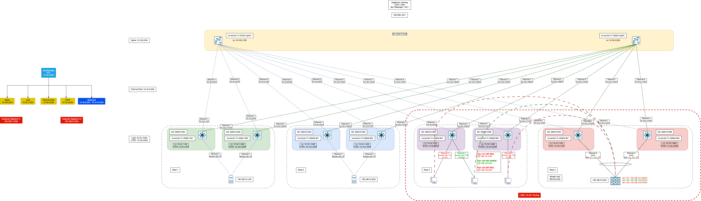

# VxLAN. Routing.

## Цель
* Реализовать маршрутизацию между "клиентами" (tentant) через EVPN route-type 5

**Ожидаемый результат**

1. Два "клиента" размещены в разных VRF в рамках одной фабрики.
2. Настроена маршрутизацию между клиентами через внешнее устройство (граничный роутер\фаерволл\etc).
3. В документации зафиксированы - план работы, адресное пространство, схему сети, настройки сетевого оборудования.

## Достижение результата
### Введение

Модернизируем схему и встраиваем в нее NGFW Palo Alto Networks (PAN-OS 11.0.0). FW будет подключен аггрегированным линком в no-osl-dc1-f1-r03k04-lf01 и no-osl-dc1-f1-r03k04-lf02
